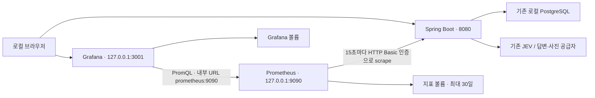

# PR-014 로컬 Prometheus·Grafana 관측 구성

> Archive: 당시 설계·구현·검증 기록이다. 현재 계약과 실행 방법은 [루트 문서 지도](../../../README.md#문서-찾기)를 따른다. 남은 운영 인수는 현재 영역 문서에서 추적한다. 보관 기준은 문서 재편 전 commit `e9b1df1f93ed7a94e682cc544b33a1b6c1668029`이며 각 본문의 실제 구현·평가 대상 commit과 구분한다.

이 문서는 당시 파일명과 명령을 보존한다. 이후 local/prod 파일 분리·이름 변경을 반영한 실행 절차는 [Monitoring](../../../monitoring/README.md)을 따른다.

> 2026-10-06 정리: 아래 README·Python 검사 언급은 당시 기록이다. 해당 중복 문서와 모니터링 Python 도구는 제거했으며, 현재 절차는 [Monitoring](../../../monitoring/README.md)을 따른다.


> 작성일: 2026-10-04 (일요일)
> 상태: 승인 후 구현·로컬 검증 완료 · 아래 결과 기록 참고
> PR 번호: 예정 번호 014, 실제 PR 생성 시 조정
> 대상: Spring Boot 계측, 로컬 Prometheus·Grafana, 접근 제한, 검증·운영 문서
> 작업 위치: 기존 `main`, 별도 worktree 생성 없음
> 승인: 사용자의 main 구현·검증·문서 최신화 요청으로 진행

## 1. 목적과 합의 범위

앱을 사용하다 발생하는 오류와 지연을 시간 흐름으로 확인하고, Prometheus 수집·PromQL·Grafana 대시보드를 로컬에서 학습한다. 오류가 HTTP 처리, JVM, DB 커넥션 대기, JEV 정책 평가, 답변 생성 또는 사진 분석 중 어느 구간에서 발생했는지 좁힐 수 있어야 한다.

이전 대화에서 정한 기준은 **로컬 학습부터 시작**, **지표 보관 기간 30일**, **HTTP·JVM·DB 풀·AI 처리 관측**이다. 이번 문서는 승인된 구현 계약과 실제 검증 결과를 함께 기록한다.

### 포함

- 기존 Actuator와 Micrometer를 활용한 HTTP·JVM·프로세스·HikariCP 지표.
- JEV의 최종 정책 결정과 평가 실패, 답변 생성·사진 분석의 결과와 지연 시간.
- 공급자 응답에서 이미 얻는 토큰 사용량의 누적 집계.
- Docker Compose 기반 로컬 Prometheus·Grafana, 영속 볼륨과 재현 가능한 provisioning.
- 로컬 지표 endpoint 인증, 작은 대시보드 하나, 외부 전송 없는 알림 규칙 학습.
- 자동 검사, 테스트 대역을 이용한 장애 검증, 실제 로컬 수집·화면 확인.

### 제외·후속 단계

- EC2 설치, AWS/CDK 변경, Parameter Store 변경, CI/CD 배포와 운영 대시보드 연결.
- CloudWatch datasource·Logs 연동, Loki·로그 수집 에이전트, 분산 tracing·Tempo.
- PWA 브라우저 오류·성능 수집, 사용자 행동 분석, 음식 사진·질문 원문 수집.
- node_exporter·cAdvisor·PostgreSQL exporter, RDS 내부 쿼리·락·서버 디스크 관측.
- Slack·Telegram 메시지 전송과 Alertmanager. 채널 선택은 운영 도입 시 결정한다.
- AI 비용 확정, 모델 정확도·칼로리 추정 품질 평가, 실제 모델 호출을 동반하는 부하 테스트.
- 이벤트·비동기 처리 도입, 유스케이스 리팩토링, DB schema·migration 변경.
- 별도 요청 없는 commit/push.

## 2. 구현 전 저장소에서 확인한 상태

| 영역 | 구현 전 상태 | 적용 방향 |
| --- | --- | --- |
| 기반 | Java 21, Spring Boot 4.1.1, Spring AI 2.0.1 | 버전·아키텍처 유지 |
| Actuator | `spring-boot-starter-actuator` 있음, 웹 노출은 `health,info` | Prometheus registry 추가, 로컬 `monitoring` 프로필에서만 수집 endpoint 노출 |
| 로컬 Compose | PostgreSQL 17 한 서비스 | 기존 파일 유지, 모니터링용 독립 Compose 파일 추가 |
| 웹 보안 | API는 인증 필요, 나머지 경로는 기본 허용 | 지표 경로를 위한 별도 인증 체인 추가, 기존 OAuth2·세션·CSRF 계약 유지 |
| 정책 평가 | `AiPolicyGuard`가 JEV 결과를 `AiPolicyRun.Success/Failure`로 반환 | 반환 결과를 기준으로 판정·실패를 계측 |
| 답변 생성 | `AiProviderExecutor`가 Out Port 호출 | 해당 호출 구간의 성공·실패·지연·토큰 계측 |
| 사진 분석 | `FoodPhotoService`가 파일 준비·DB 처리·외부 분석을 조율 | `gateway.analyze` 호출과 검증된 분석 결과를 계측 |
| 진단 이력 | `AiRequestLog`에 모델·버전·결과·오류·지연·토큰 저장 | 유지. Prometheus가 DB를 주기적으로 조회하지 않음 |
| 일반 검사 | Checkstyle, ArchUnit, Modulith, 동작 테스트가 Gradle·CI에 연결 | 기존 검사 유지, 계측·보안·설정 검증 추가 |

근거 파일: [빌드 설정](../../../build.gradle.kts), [앱 설정](../../../src/main/resources/application.yml), [기존 Compose](../../../docker-compose.yml), [보안 설정](../../../src/main/java/com/myfitness/common/infrastructure/config/SecurityConfig.java), [정책 Guard](../../../src/main/java/com/myfitness/ai/application/support/policy/AiPolicyGuard.java), [Provider Executor](../../../src/main/java/com/myfitness/ai/application/support/AiProviderExecutor.java), [사진 Service](../../../src/main/java/com/myfitness/ai/application/service/FoodPhotoService.java), [CI](../../../.github/workflows/ci.yml).

## 3. 선택한 구성과 이유

**권장안은 호스트에서 실행하는 기존 Spring Boot 앱과, 독립 Compose에서 실행하는 Prometheus·Grafana의 조합**이다. 앱까지 컨테이너로 바꾸거나 새로운 SaaS를 추가하지 않고 현재 개발 흐름에서 수집을 학습할 수 있다.

| 대안 | 판단 |
| --- | --- |
| 호스트 앱 + 모니터링 Compose | 채택. 기존 `bootRun`과 DB Compose를 유지하며 지표·설정만 추가 |
| 앱·DB·모니터링 전체 컨테이너화 | 실행 환경은 통일되지만 앱 빌드·프론트 번들·개발 흐름까지 변경하므로 제외 |
| Grafana Cloud 또는 현재 EC2에 설치 | 서비스 가입·비용·운영 접근 경계가 추가되므로 로컬 학습 후 검토 |

Spring Boot는 registry가 classpath에 있으면 구성하고, Prometheus는 앱의 `/actuator/prometheus`를 pull 방식으로 수집한다. 직접 metrics Controller나 HTTP 전송 코드를 만들지 않는다. [Spring Boot Metrics](https://docs.spring.io/spring-boot/reference/actuator/metrics.html)



Prometheus 수집 실패가 앱의 요청 처리나 DB 저장을 막지 않는다. 앱은 수집기를 호출하지 않고 메모리의 meter를 갱신한다. 메트릭은 관측용 파생 데이터이며 DB 이력과 같은 영속·정확한 이벤트 장부가 아니다. 앱이 재시작되면 누적값은 초기화되고, 두 scrape 사이의 종료·장애로 일부 관측이 누락될 수 있다.

## 4. 수집 계약

### 4.1 자동 수집

| 대상 | Micrometer 이름 예시 | 분석 용도와 한계 |
| --- | --- | --- |
| HTTP | `http.server.requests` | API 요청 수, 상태 코드, 5xx 비율, 평균·p95 지연. 요청 처리 전체 시간이며 외부 호출 시간을 포함 |
| JVM | `jvm.memory.used/max`, `jvm.gc.pause`, `jvm.threads.live` | heap 사용 비율, GC 시간·횟수, 스레드 변화 |
| 프로세스 | `process.cpu.usage`, `process.uptime`, `system.cpu.usage` | 앱 CPU·가동 시간과 실행 환경 CPU. EC2·컨테이너 전체 자원 분석을 대체하지 않음 |
| DB 풀 | `hikaricp.connections.active/idle/max/pending`, `hikaricp.connections.acquire` | 풀 점유·대기·획득 시간. SQL 실행 시간·DB CPU·락 원인을 직접 보여주지 않음 |
| 수집 상태 | Prometheus `up`, `scrape_duration_seconds` | target 연결·인증·scrape 상태. `up=0`만으로 앱 프로세스 종료를 단정하지 않음 |

원래 framework 지표를 다시 만드는 Counter나 모든 Service에 붙이는 `@Timed`는 추가하지 않는다. HTTP `uri`는 템플릿 경로를 쓰며 ID가 들어간 실제 URL·쿼리 문자열을 label로 사용하지 않는다. 대시보드의 API 집계에서는 정적 파일과 `/actuator/**`를 제외한다.

### 4.2 직접 추가할 AI 지표

| Micrometer 이름 / 타입 | Prometheus 이름 | label | 계측 범위 |
| --- | --- | --- | --- |
| `app.ai.policy` / Timer | `app_ai_policy_seconds_count/sum/bucket` | `action`, `topic`, `error` | Guard 진입부터 최종 정책 결정 또는 평가 실패까지 |
| `app.ai.provider` / Timer | `app_ai_provider_seconds_count/sum/bucket` | `kind`, `provider`, `outcome`, `error` | 텍스트 Out Port 또는 사진 분석 Out Port 호출부터 반환·실패까지, DB 저장 제외 |
| `app.ai.tokens` / Counter, 단위 tokens | `app_ai_tokens_total` | `kind`, `provider`, `direction` | 검증된 성공 응답에서 얻은 input/output 토큰 누적 |

Timer의 `count`로 처리 건수를 구하므로 같은 호출에 대한 요청 Counter를 중복으로 추가하지 않는다. 완료된 호출만 기록되며 처리 중 요청 수는 이번 범위에 포함하지 않는다.

고정 label 값:

- 정책 `action`: `ALLOW`, `BLOCK`, `SAFE_REDIRECT`, `CLARIFY`, `UNAVAILABLE`.
- 정책 `topic`: Out Port의 일곱 주제, 평가 실패는 `UNKNOWN`.
- 정책 `error`: 성공은 `NONE`. 실패는 `CONFIGURATION`, `TIMEOUT`, `NETWORK`, `INTERRUPTED`, `MODEL_MISMATCH`, `POLICY_ERROR`, `HTTP_4XX`, `HTTP_5XX`, `HTTP_OTHER`, `INVALID_RESPONSE`와 현재 검증 단계별 `INVALID_RESPONSE_JSON/TOPIC/USAGE/MEDICAL_DECISION/UNSAFE_ACTION/URGENT_SIGNAL/POLICY_BYPASS/ASSESSMENT`, 그 외는 `OTHER`로 제한한다.
- 공급자 `kind`: `chat`, `photo`. 토큰의 `kind`에는 `policy`도 포함한다.
- 공급자 `provider`: `openai`, `ollama`, `none`, `other`. 정책 토큰에는 `jev`를 사용한다.
- 공급자 `outcome`: 텍스트는 `SUCCESS/FAILURE`, 사진은 `FOOD/NOT_FOOD/UNCERTAIN/FAILURE`.
- 공급자 `error`: 성공은 `NONE`. 기존 사진 실패 코드 `CONFIGURATION_ERROR/TIMEOUT/TRANSPORT_ERROR/HTTP_ERROR/INVALID_RESPONSE/MODEL_REFUSAL/INCOMPLETE_RESPONSE`, 기존 텍스트 실패 `AI_PROVIDER_UNAVAILABLE`, 그 외는 `OTHER`로 제한한다.
- 토큰 `direction`: `input/output`. JEV의 현재 Out Port는 input만 제공하므로 output을 만들어내지 않는다.

원래 상세 오류 코드는 DB 이력에 그대로 남긴다. label 정규화는 관측에서만 적용하며 예외·응답 계약을 바꾸지 않는다. 텍스트 공급자 오류를 현재 코드보다 세밀하게 구분하는 리팩토링은 이번 작업에 넣지 않는다.

모델명·정책 버전·판정 근거는 기존 DB 이력에서 확인한다. 변경 가능한 문자열을 label에 계속 누적시키지 않는다. 사용자·대화·메시지 ID, 음식명, 파일명, 원문 질문·답변·사진, API 키, 예외 message와 stacktrace를 label에 넣지 않는다.

한 호출은 해당 Timer에 정확히 한 번 기록한다. 정책 제한은 정상 결정이며 공급자 실패가 아니다. JEV 실패와 제한에서는 답변 생성 Timer·토큰이 증가하지 않는다. 파일 검증 실패는 HTTP 4xx로 관측하고 사진 공급자 호출로 세지 않는다. 사진 `NOT_FOOD/UNCERTAIN`도 정상 판별 결과이며 장애 비율에 포함하지 않는다.

토큰 값이 null이면 기록하지 않고, 명시적인 0만 0으로 처리한다. 실패한 요청의 공급자 과금·누락된 usage는 알 수 없으므로 화면에 **관측된 토큰**으로 표시한다. 기존 Spring AI 자동 `gen_ai.*` 계측은 유지하되, 요청 종류를 나눈 대시보드의 기준은 위 앱 지표로 통일하고 두 지표를 더하지 않는다. 공급자 청구 금액·전체 사용량으로 표현하지 않는다. [Spring AI Observability](https://docs.spring.io/spring-ai/reference/observability/index.html)

### 4.3 지연 histogram

- HTTP API: 0.05, 0.1, 0.25, 0.5, 1, 2, 5, 10, 30, 60초.
- 정책: 0.05, 0.1, 0.25, 0.5, 1, 1.5, 2, 5초.
- 답변·사진: 0.5, 1, 2, 5, 10, 20, 30, 60초.
- 위 경계의 classic histogram bucket만 발행한다. 자동 percentile histogram·클라이언트별 percentile을 함께 추가하지 않는다.
- 각 지표의 전체 시간과 실패 시간도 포함한다. HTTP와 정책·공급자 시간은 포함 관계이므로 합산하지 않는다.
- 짧은 관측 구간의 p95는 표본이 적으면 불안정하다. 해당 구간 20건 미만이면 p95를 N/A로 표시하고 건수·평균·개별 DB 이력으로 확인한다.

## 5. 계측 책임과 아키텍처

| 위치 | 유지할 책임 / 추가할 역할 |
| --- | --- |
| `ai.application.support.AiMetrics` (계획) | 앱 AI 지표 등록·label 정규화·시간·토큰 기록만 담당하는 구체 클래스 하나 |
| `AiPolicyGuard` | 기존 `Success/Failure` 생성 후 그 결과를 한 번 계측. 예외가 Failure로 바뀌는 특성상 메서드 예외 유무로 장애를 추정하지 않음 |
| `AiProviderExecutor` | 기존 Out Port 호출의 성공·실패 및 검증된 응답 usage 계측. DB·transaction Service 호출 금지 |
| `FoodPhotoService` | 기존 외부 분석 메서드에서 호출 결과 계측. 성공·실패 DB 저장과 구분해 측정하고 저장 오류를 공급자 실패로 다시 세지 않음 |
| `common.infrastructure.config` | registry 공통 application tag, 로컬 endpoint 보안 설정 |
| 기존 Infrastructure Client | JEV HTTP, Spring AI, 파일 처리·응답 검증 책임 유지 |

직접 Micrometer Timer·Counter를 사용한다. 별도 AOP·AspectJ 의존성, 범용 계측 callback·전략, Metrics Out Port, 새 모듈·Entity를 만들지 않는다. `@Timed`만으로 표현하기 어려운 정상 제한과 `Failure` 반환을 결과 기반 계측으로 처리한다.

Application은 Infrastructure 구현이나 Spring AI SDK를 참조하지 않는다. Domain에는 계측 의존성을 넣지 않는다. Micrometer 사용은 기존 Spring 의존을 허용하는 Application Support 내부의 관측 책임에 한정한다. 공개 In/Out Port와 DTO·DB 계약을 계측 때문에 변경하지 않는다.

외부 호출 중 DB transaction을 유지하지 않는 현재 경계와 JEV 단일 경로를 보존한다. Java `var` 금지, 계층·Support 방향, Named Interface·허용 모듈 의존성 검사를 완화하지 않는다.

## 6. 로컬 설정·보안·비밀값

### 6.1 실행 프로필과 접근 경계

- 추가 의존성: `io.micrometer:micrometer-registry-prometheus`. Spring Boot 의존성 관리 버전을 사용한다.
- 기본·`prod` 프로필의 endpoint exposure는 기존 `health,info`를 유지한다. Prometheus 웹 노출과 수집 설정은 `monitoring`에서만 활성화한다.
- 앱의 기존 8080 포트를 사용한다. 별도 관리 포트·TLS·프록시는 이번 로컬 단계에 추가하지 않는다.
- `monitoring`에서 높은 우선순위의 SecurityFilterChain이 **`/actuator/prometheus`만** 매칭한다. HTTP Basic 전용 계정으로 인증하며 OAuth2 세션 사용자에게 지표 접근 권한을 주지 않는다.
- 인증 정보가 없거나 틀리면 401, 올바르면 200 및 Prometheus 본문이다. 지표 요청은 OAuth2 로그인 화면으로 redirect하지 않는다.
- 전용 AuthenticationManager와 stateless 체인으로 OAuth2·API 세션 로그인에 계정·인증 방식이 섞이지 않게 한다. 전체 앱의 CSRF·인증 정책을 해제하지 않는다.
- `monitoring` 프로필에서 비밀번호가 없거나 비어 있으면 시작을 실패시킨다. 공통 기본 비밀번호·무인증 fallback을 두지 않는다.
- profile 미활성 시 인증 여부와 관계없이 지표 본문을 제공하지 않는지 실제 endpoint 테스트로 확인한다. 운영 profile에 `monitoring`을 함께 켜지 않는다.
- Prometheus UI는 `127.0.0.1:9090`, Grafana는 `127.0.0.1:3001`에만 publish한다. frontend 3000과 충돌하지 않는다. Grafana는 관리자 로그인 필요, 익명 접근은 비활성이다.
- macOS Docker Desktop의 Prometheus target은 `host.docker.internal:8080`. Linux에서는 `host-gateway` 매핑으로 동일 이름을 연결한다. Docker 내부의 `localhost:8080`를 target으로 사용하지 않는다.

로컬 HTTP Basic은 개발 PC와 로컬 Docker 네트워크 범위의 구성이다. 운영에서는 사설 경로·TLS·접근 통제를 별도로 설계해야 하며 이 설정을 그대로 외부 공개하지 않는다.

### 6.2 설정 파일과 비밀값

구현 파일:

```text
src/main/resources/application-monitoring.yml
monitoring/docker-compose.yml
monitoring/prometheus/prometheus.yml
monitoring/prometheus/alerts.yml
monitoring/prometheus/alerts.test.yml
monitoring/grafana/provisioning/datasources/prometheus.yml
monitoring/grafana/provisioning/dashboards/dashboards.yml
monitoring/grafana/dashboards/my-fitness.json
monitoring/README.md
scripts/setup-local-monitoring.sh
scripts/test-monitoring-config.py
scripts/verify-local-monitoring.py
```

비밀값은 Git 추적에서 제외할 `.local/monitoring/secrets/`에 둔다. 설정 helper는 지표 비밀번호와 Grafana 관리자 비밀번호를 난수로 생성하고 기존 값은 덮어쓰지 않는다. 디렉터리 700·파일 600 권한을 적용하며 값은 stdout·로그에 출력하지 않는다.

| 파일/설정 | 읽는 주체 | 계약 |
| --- | --- | --- |
| `.local/monitoring/secrets/app.monitoring.password` | Spring config tree, secret-init → Prometheus | 같은 지표 전용 비밀번호. 기본 username은 `prometheus` |
| `.local/monitoring/secrets/grafana_admin_password` | secret-init → Grafana | `GF_SECURITY_ADMIN_PASSWORD__FILE`로 읽음. username은 `admin` |
| `SPRING_PROFILES_ACTIVE=monitoring` | 앱 | 개발자가 명시적으로 활성화 |
| `management.metrics.tags.application` | 앱 | 기존 `spring.application.name`인 `my-fitness-app` |

Spring은 repository root 기준 `configtree:.local/monitoring/secrets/`를 monitoring 프로필에서 읽고, Docker Compose의 일회성 `secret-init`은 같은 파일을 읽기 전용 secret으로 읽어 컨테이너 전용 볼륨에 복사한다. Prometheus UID 65534와 Grafana UID 472에 각각 파일 소유권을 부여하고 600 권한을 유지한다. 두 서버는 `/credentials`를 읽기 전용으로 마운트한다. 이 경계는 Linux의 파일 바인드 UID 불일치를 처리하며 호스트 권한은 완화하지 않는다. 환경변수나 Compose 출력에 비밀번호를 펼쳐 넣는 템플릿 생성은 하지 않는다. 기존 `.env`와 AI 키는 수정하거나 출력하지 않는다. [Grafana Docker secret 설정](https://grafana.com/docs/grafana/latest/setup-grafana/configure-docker/)

## 7. 수집·보관·대시보드 계약

### 7.1 Prometheus·Grafana

- 적용 이미지: `prom/prometheus:v3.15.0`, `grafana/grafana:13.2.3`. 공식 배포 자료를 기준으로 선택했으며 ARM64/AMD64 manifest와 macOS Docker Desktop ARM64에서 실제 기동을 확인했다. AMD64/Linux 호스트 전체 기동은 미검증이다. `latest`는 사용하지 않는다. [Prometheus 배포](https://prometheus.io/download/), [Grafana 13.2.3](https://github.com/grafana/grafana/releases/tag/v13.2.3)
- 앱 job 이름 `my-fitness`, scrape interval 15초, timeout 5초, rule evaluation interval 15초.
- `metrics_path: /actuator/prometheus`, `basic_auth.username: prometheus`, `password_file`은 `/credentials/metrics_password` 사용.
- TSDB 보관 `--storage.tsdb.retention.time=30d`, 용량 안전장치 `--storage.tsdb.retention.size=2GB`.
- 시간·용량 중 먼저 도달한 조건이 적용된다. 따라서 **최대 30일 보관**이며 2GB에 먼저 도달하면 오래된 지표가 더 일찍 제거된다. 2GB는 디스크의 엄격한 상한이 아니며 WAL·head·compaction 여유가 필요하다. 로컬 사용량을 확인해 조정한다. [Prometheus Storage](https://prometheus.io/docs/prometheus/latest/storage/)
- Prometheus와 Grafana는 서로 다른 named volume 사용. `down` 후 다시 `up`할 때 데이터가 유지된다. `down -v`는 데이터를 지우는 명시적 초기화 작업으로 문서화한다.
- 로컬 학습 자료는 별도 백업·고가용성 대상에 포함하지 않는다. dashboard JSON과 provisioning은 Git으로 관리한다.
- Grafana datasource UID `my-fitness-prometheus`, URL `http://prometheus:9090`, dashboard UID `my-fitness-local`. datasource·dashboard는 시작 시 provisioning하며 UI 수정은 파일을 기준으로 반영한다. [Grafana Provisioning](https://grafana.com/docs/grafana/latest/administration/provisioning/)

### 7.2 대시보드 한 개, 네 영역

기본 시간 범위 최근 30분, 자동 새로고침 15초, 시간대 `Asia/Seoul`. 학습용으로 24시간·7일·30일 범위를 선택할 수 있다. 현재 앱 한 target이므로 환경 선택용 변수를 추가하지 않는다.

| 영역 | 패널 | 해석 |
| --- | --- | --- |
| 요청·상태 | up, uptime, API 요청 수·5xx 건수/비율, 평균/p95, endpoint별 느린 요청 | 서버·경로별 장애/지연의 발생 시점 |
| JVM·DB 풀 | CPU, heap 사용률, GC 시간·횟수, 스레드, active/idle/max/pending, acquisition 평균 | 메모리 압박·GC·DB 커넥션 대기 여부 |
| JEV·AI | 정책 결정 분포·주제·오류, 정책 평균/p95, chat/photo 결과·오류·평균/p95 | 제한 응답·정책 장애·생성 장애를 구분 |
| 사용량·규칙 | 종류·공급자별 관측 토큰, Prometheus pending/firing 알림 수와 목록 | 사용량 변화와 학습용 규칙 상태 |

5xx는 HTTP 서버 장애이며 정책 `BLOCK/SAFE_REDIRECT/CLARIFY`와 사진 `NOT_FOOD/UNCERTAIN`을 오류로 표시하지 않는다. 정책 분포는 실제 선택 분포일 뿐 모델 정확도·정책의 적정성 지표가 아니다.

트래픽이 없는 구간과 분모 0의 비율은 N/A로 표시한다. label이 아직 생성되지 않은 지표도 정상적인 빈 상태로 처리한다. 앱의 counter 재시작은 `rate/increase`로 처리하되, 비정수 `increase` 결과는 scrape 기반 추정 건수임을 안내한다.

### 7.3 PromQL 기준 예시

아래는 구현할 query 기준이며 아직 실제 수집 결과가 아니다. 분모와 분자는 같은 job·경로·시간 범위를 사용한다.

```promql
# API 요청 속도 / 초
sum(rate(http_server_requests_seconds_count{job="my-fitness",uri=~"/api/.*"}[5m]))

# API 5xx 비율: 무트래픽은 N/A
sum(rate(http_server_requests_seconds_count{job="my-fitness",uri=~"/api/.*",status=~"5.."}[10m]))
/
sum(rate(http_server_requests_seconds_count{job="my-fitness",uri=~"/api/.*"}[10m]))

# JEV 최종 결정 분포
sum by (action) (increase(app_ai_policy_seconds_count{job="my-fitness"}[$__range]))

# 공급자 호출 p95: 종류별, bucket의 le 유지
histogram_quantile(0.95,
  sum by (le, kind) (rate(app_ai_provider_seconds_bucket{job="my-fitness"}[10m]))
)

# 관측된 토큰: 기존 gen_ai.*와 더하지 않음
sum by (kind, provider, direction) (increase(app_ai_tokens_total{job="my-fitness"}[$__range]))
```

패널 구현에서는 표본 부족 조건과 성공 중 오류 label이 없을 때의 빈 series 처리를 보완한다. 실제 exporter의 이름·label과 Prometheus query 결과를 대조한 후 JSON을 확정한다.

## 8. 알림 학습

Prometheus rule 파일 한 곳에 규칙을 두고 Prometheus Alerts 화면과 Grafana의 `ALERTS` 패널로 상태를 확인한다. Grafana Alerting에 같은 규칙을 중복 작성하지 않는다. 전송 대상·웹훅·봇·추가 알림 서버는 만들지 않는다.

| 규칙 | 제안 조건 | 지속 조건 |
| --- | --- | --- |
| AppMetricsUnavailable | 앱 job `up == 0` | 2분 |
| ApiServerErrors | 최근 10분 API 5xx 추정 3건 이상 **그리고** 5xx 비율 5% 이상 | 2분 |
| PolicyUnavailable | 최근 10분 `UNAVAILABLE` 추정 3건 이상 **그리고** 전체 정책 평가 대비 20% 이상 | 2분 |
| AiProviderFailures | 종류별 최근 10분 `FAILURE` 추정 3건 이상 **그리고** 해당 종류 호출 대비 20% 이상 | 2분 |
| JvmHeapPressure | 유효한 heap max 합계 대비 used 합계 85% 초과 | 10분 |
| DbPoolWaiting | Hikari pending > 0 | 2분 |

임계값은 운영 경험으로 검증한 SLO가 아닌 로컬 학습용 초기값이다. 트래픽이 적다는 조건을 반영해 비율만으로 알리지 않는다. 무트래픽·일시적 실패·제한 결정에는 오류 알림이 발생하지 않아야 한다. No Data는 정상으로 위장하지 않고 패널에 표시하며, 앱 연결 실패는 `up`으로 확인한다.

메모리 max가 0 이하인 pool은 분모에서 제외한다. 알림 설명에는 어떤 지표를 확인할지와 운영 문서 위치를 적고, 질문·사용자 정보는 넣지 않는다. `promtool test rules`로 무트래픽·임계값 아래·pending·firing·복구를 합성 시계열로 검증한다.

## 9. 승인 이후 구현 계획과 검증

### 1단계 — registry·프로필·접근 제한

1. 먼저 실제 HTTP endpoint 테스트로 monitoring의 무인증·잘못된 인증 401, 올바른 인증 200, 비활성 프로필의 지표 비노출, 비밀번호 미설정 시작 실패를 확인한다.
2. registry dependency, `application-monitoring.yml`, 전용 보안 설정·공통 tag를 최소 추가한다.
3. 기존 OAuth2/세션 API와 `/actuator/health` 접근 계약 회귀를 확인한다. 설정 프로필이 비활성인 기존 테스트도 통과해야 한다.

완료 기준: 인증 없이 지표를 읽을 수 없고, 새 설정이 기본·prod의 공개 지표 endpoint를 만들지 않는다.

### 2단계 — AI 결과 계측

1. `SimpleMeterRegistry` 또는 Micrometer 테스트 Clock으로 결과별 건수·시간·토큰을 검증하는 테스트를 먼저 작성한다.
2. `AiMetrics`와 Guard·Executor·사진 분석 호출 구간에 최소 계측을 추가한다. 기존 DB 저장 책임을 옮기지 않는다.
3. 기존 AI API 테스트의 대역을 재사용해 정책 제한·장애에서 생성 호출이 없고 기존 200/503·저장 계약이 유지되는지 확인한다.
4. 계측은 정상 결정/실패 각각 한 번, 토큰 누락은 미기록, 원문 없는 고정 label, DB 저장 오류는 공급자 성공 뒤 실패로 중복 집계되지 않음을 검증한다.

완료 기준: 정책 `ALLOW/BLOCK/SAFE_REDIRECT/CLARIFY`, 정책 timeout/network/invalid response, chat 성공/실패, 사진 `FOOD/NOT_FOOD/UNCERTAIN`·장애·파일 거절을 구분한다. JEV와 생성 API는 테스트 대역을 사용한다.

### 3단계 — 로컬 Compose·provisioning·알림

1. secret helper, 별도 Compose, Prometheus 설정·규칙·합성 테스트, Grafana datasource·dashboard를 추가한다.
2. 설정 검사 스크립트는 기본 공개 노출·비밀값 하드코딩·태그·retention·datasource/UID·JSON 형식을 확인한다. runtime password를 출력하지 않는다.
3. 고정 이미지의 `promtool check config`, `check rules`, `test rules`를 실행한다. Docker Compose 정적 구성도 검사한다.
4. `monitoring` 앱과 컨테이너를 실제 기동해 authenticated scrape, Targets UP, datasource 연결·패널 query, 볼륨 재시작 유지·Grafana 화면을 확인한다.
5. 앱 중지 후 AppMetricsUnavailable의 pending→firing, 다시 시작 후 복구를 확인한다. AI 장애는 테스트 대역·합성 시계열로 확인하며 실키 요청을 자동으로 보내지 않는다.

완료 기준: dashboard 파일이 provisioning되어 사람이 datasource·패널을 매번 만들 필요가 없고, 데이터 없음·정상·장애를 구분해서 볼 수 있다.

### 4단계 — 일반 검사·CI·현재 문서

검증 명령:

```bash
./gradlew checkstyleMain checkstyleTest --no-daemon
./gradlew test --tests 'com.myfitness.architecture.*' --tests 'com.myfitness.convention.*' --no-daemon
./gradlew test --tests 'com.myfitness.ai.*' --tests 'com.myfitness.user.integration.UserSecurityIntegrationTest' --tests 'com.myfitness.common.*' --no-daemon
./gradlew build --no-daemon
python3 scripts/test-monitoring-config.py
bash -n scripts/setup-local-monitoring.sh
docker compose -f monitoring/docker-compose.yml config --quiet
```

`promtool`은 위 고정 Prometheus 이미지 안에서 실행하고 설정·규칙 파일을 읽기 전용 mount한다. CI용 secret fixture는 runner의 임시 디렉터리에서 만들고 끝나면 제거한다. CI에서는 실제 JEV/OpenAI 키·Google 로그인·AWS 접속을 요구하지 않는다. CI verify에 정적 설정·규칙 검사를 추가하되 Deploy App workflow·운영 배포 스크립트는 변경하지 않는다.

실패한 검사는 원인을 수정하고 재실행한다. 기존 Checkstyle·ArchUnit·Modulith를 삭제하거나 허용 의존성·예외·검사 범위를 완화하지 않는다. 실제 Spring AI 자동 meter·Hikari meter 이름은 실행 환경에서 확인해 query와 맞춘다.

구현 뒤 `README.md`, `docs/architecture.md`, `infra/README.md`, `infra/README.md`와 신규 `monitoring/README.md`에 **로컬에서만 추가된 현재 상태**를 반영한다. 운영 설치가 끝난 것처럼 표현하지 않는다. 스펙에는 변경 결정과 실행 결과를 추가하며 과거 평가 결과·migration을 덮어쓰지 않는다.

## 10. 로컬 사용·복구 절차의 목표

구현된 파일을 사용하는 아래 명령은 repository root에서 실행한다. 상세 절차는 [monitoring/README](../../../monitoring/README.md)를 따른다.

```bash
# 초기 비밀번호 파일 생성, 기존 값은 보존
bash scripts/setup-local-monitoring.sh

# 기존 로컬 DB
docker compose up -d postgres

# 기존 AI 환경변수 주입 방식 유지. 기본 AI_PROVIDER=none에서도 수집 학습 가능
SPRING_PROFILES_ACTIVE=monitoring ./gradlew bootRun

# 다른 터미널: Prometheus와 Grafana
docker compose -f monitoring/docker-compose.yml up -d

# 모니터링만 종료, 볼륨 보존
docker compose -f monitoring/docker-compose.yml down
```

Grafana URL은 `http://localhost:3001`, Prometheus URL은 `http://localhost:9090`이다. Grafana 초기 암호는 개발자가 로컬 파일에서 확인하며 문서·스크립트 출력에는 값이 들어가지 않는다. 기존 Grafana 볼륨이 있으면 초기 암호 파일 변경만으로 계정 암호가 바뀌지 않으므로 UI에서 암호 변경하거나 학습 데이터를 의도적으로 초기화하는 절차를 안내한다.

Targets DOWN이면 앱 실행→프로필→host 연결→401/인증 파일→scrape timeout 순서로 확인한다. Grafana No Data이면 Prometheus target→query series→시간 범위→datasource 순서로 확인한다. 인증 진단 시 비밀번호를 명령줄 인자·로그에 넣지 않는다.

컨테이너가 비밀값을 읽지 못하면 `secret-init` 완료와 실제 UID·`/credentials`의 소유권 및 600 권한을 확인한다. CI에서도 각 서버 UID의 파일 읽기와 다른 계정 파일 접근 거절을 확인한다. 포트를 전체 인터페이스에 공개하거나 비밀번호를 공통값으로 바꿔 문제를 우회하지 않는다.

## 11. 전체 인수 기준과 보고 범위

- [x] default/prod의 공개 지표 비노출, monitoring 인증·설정 실패·기존 API 보안 계약 확인.
- [x] 정상/제한/장애의 AI meter가 정확히 한 번 갱신되고 제한·장애 시 생성 호출 없음.
- [x] 외부 호출 중 transaction이 유지되지 않으며 DB·API·모듈 공개 계약 변화 없음.
- [x] 사용자 원문·식별자·키가 metric label·새 로그·추적 파일에 없음.
- [x] 실제 앱 scrape에서 HTTP·JVM·풀 확인, Prometheus registry 테스트에서 AI 지표 이름·histogram bucket 확인. 실제 AI 호출은 미실행.
- [x] Targets UP, Grafana provisioning·패널·표본 부족 표시, 재시작 데이터 유지 확인.
- [x] 합성 규칙 검사와 로컬 앱 중지·복구 시나리오 통과.
- [x] Checkstyle·ArchUnit·Modulith·관련 동작·일반 build·CI에 추가한 로컬 설정 검사 통과. 원격 GitHub Actions 실행은 미검증.
- [x] 실행 명령·결과·소프트웨어 버전·미검증 항목을 구분해서 보고.

30일 경과에 따른 실제 자동 삭제는 짧은 구현 검증에서 완료했다고 주장하지 않는다. retention 설정·동작 계약을 확인하고 장기 관측은 이후 사용으로 검증한다. 테스트 대역으로 본 정책 분포·장애 결과를 실제 모델 품질로 표현하지 않는다. 운영 연결·비용·실제 사용자 트래픽의 원인 분석·Slack/Telegram 전송은 이번 완료 조건에 없다.

## 12. 승인 항목과 현재 결과

사용자가 이 문서의 범위와 구현 계획 전체를 승인했다. 특히 **로컬만 구성**, **최대 30일/2GB 보관**, **HTTP Basic으로 앱 지표 보호**, **직접 계측은 AI 결과 중심**, **알림은 상태 확인까지만**을 기준으로 한다. 추가로 선택해야 하는 필수 항목은 없다. 외부 알림 채널과 운영 위치는 후속 단계로 남긴다.

현재 결과: 사용자 승인 이후 동일 `main`에서 애플리케이션 계측·인증과 로컬 Compose·대시보드·알림 규칙을 구현했다. Gradle build와 관련 검사를 통과했으며 실제 authenticated scrape와 datasource·25개 패널 query, Grafana 화면을 확인했다. 앱 중지·복구에 따른 pending/firing/해제, 재시작 후 기존 시각의 지표 보존도 확인했다. Spring AI `EmptyUsage`를 실제 0 사용량과 구분하도록 수정했으며 세부 결과와 미검증 범위는 [검증 기록](2026-10-04-local-observability-validation.md)에 남긴다. 운영 설치·실제 모델 품질 검증은 수행하지 않았다.
