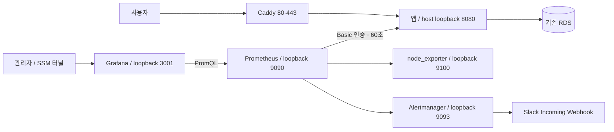

# 단일 EC2 운영 모니터링 · 스펙과 구현 계획

작성일: 2026-10-06 · 상태: 구현·로컬 검증, 운영 자원 인수·배포 확인은 별도

기준: `61a71e9`의 CDK·앱 배포·로컬 모니터링 구성.
대상: EC2 자원 설정, 앱 JVM, Prometheus·Grafana, 호스트 지표, 기존에 선택한 Alertmanager·Slack 연결.
계획 승인 후 구현했다. 당시 검증과 추가 보완은 [검증 기록](validation.md)에 둔다. AWS 변경과 실제 Slack 전송은 로컬 검증에 포함하지 않는다.

## 1. 목적과 선택

사용량이 적은 앱에서 HTTP·AI·JVM·DB 오류와 지연을 관측하면서 별도 모니터링 EC2를 운영하지 않는다.
현재 앱·Caddy와 같은 EC2에 모니터링을 배치하되, 자원이 부족하면 모니터링부터 중단해 앱을 보호한다.
RDS는 기존 별도 인스턴스를 유지한다.

확정된 방향은 단일 EC2, swap 확인·보완, JVM 메모리 조정, 수집 부하·보관량 축소다.
이번 구현은 기존 micro·20GiB를 유지하고 아래 60초·3일/1GB·메모리 한도를 시험 초기값으로 적용한다. 증설은 실제 자원 인수 후 별도 결정한다.
**권장 운영 기준은 단일 t4g.small(2GiB)**이다. t4g.micro(1GiB) 유지는 제한된 시험으로 다루며,
swap을 더 크게 만들거나 heap을 무작정 낮춰 상시 운영이 가능하다고 판단하지 않는다.
[AWS T4g 사양](https://aws.amazon.com/ec2/instance-types/t4/)

별도 서버는 장애 격리와 자원 여유가 좋지만 추가 운영 대상이 생긴다. 이번에는 단일 서버의
장애 격리 한계를 수용하고, 자원 검사와 중단 기준을 갖춘 작은 구성을 선택한다.

## 2. 변경 전 구성과 구현 계약

현재 상태는 저장소 설정을 확인한 것이며 실제 EC2의 RAM 사용량·swap 활성화·남은 디스크를 확인한 결과는 아니다.

| 영역 | 변경 전 코드 | 구현 계약 |
| --- | --- | --- |
| EC2 | t4g.micro, ARM64, Amazon Linux 2023, gp3 20GiB | 같은 EC2에 설치. micro 시험, 인수 실패 시 small 증설 검토 |
| Swap | user data에서 `/swapfile` 2GiB 최초 생성 | 2GiB 유지, 활성화·권한·fstab 확인, swappiness 10 시험 |
| 앱 | Docker RAM 700MiB, swap 한도 미지정 | RAM 448MiB 시험, RAM+swap 512MiB로 명시 |
| JVM | Xms128m, Xmx512m, G1GC | Xms64m, Xmx256m, G1GC 유지 |
| 수집·평가 | 로컬 15초·15초, timeout 5초 | 운영 60초·60초, timeout 5초 |
| TSDB 보관 | 로컬 30일 또는 2GB | 운영 3일 또는 1GB 중 먼저 도달하는 조건 |
| Grafana | 로컬 bridge network, 파일 provisioning | 운영 Linux host network·loopback, 대시보드 재사용 |
| 지표 접근 | monitoring 프로필의 Basic 인증, prod 단독은 비노출 | 운영만 `prod,monitoring` 활성화·전용 암호 주입·Caddy 차단 |
| 알림 | Prometheus 규칙 6개, 외부 전송 없음 | 규칙 유지, Alertmanager에서 Slack 그룹화·전송 |
| 호스트 관측 | EC2 메모리·swap·디스크 수집 없음 | node_exporter 최소 collector와 Prometheus 자체 지표 추가 |
| 배포 | 앱만 ECR·SSM으로 배포 | 모니터링 설정도 같은 검증 SHA로 SSM에 전달, 볼륨 보존 |

운영 전용 설정을 추가하고 로컬 학습의 15초·30일 설정은 유지한다. 기존 Java 계측과 AI 오류 enum,
정책/생성 처리·트랜잭션·DB schema는 변경하지 않는다. CloudWatch Logs, Loki, tracing,
cAdvisor, RDS exporter, HA와 원격 TSDB는 이번 범위에 넣지 않는다.
축소 heap 시험에서 최대 PNG의 동시 디코딩 실패를 재현해, 기존 ImageIO 전처리에 source subsampling을 추가했다. 입력 제한과 최종 1600 edge JPEG 계약은 유지한다.

## 3. 자원 계약과 운영 가능 여부

### Swap과 JVM

기존 user data는 `/swapfile`이 있을 때 활성화 상태를 재확인하지 않는다. 기존 EC2에서는
user data 수정만으로 보완되지 않으므로 운영 준비 스크립트를 SSM으로 별도 실행한다.

- 없을 때만 2GiB를 생성한다. 기존 파일을 재포맷·확대하거나 `mkswap`으로 덮어쓰지 않는다.
- 기존 파일의 크기·소유자·600 권한·활성화를 확인한다. 예상과 다르면 자동 교체 대신 중단한다.
- fstab 항목을 중복 추가하지 않는다. sysctl 설정은 별도 파일에 기록하고 기존 값을 복구할 수 있게 보존한다.
- `vm.swappiness=10`은 시험 초기값이다. 실제 swap I/O와 API 지연을 함께 측정한다.
- swap 사용량 자체와 계속 발생하는 swap-in/out을 구분한다. RAM 부족을 정상적으로 버티는 용도로 삼지 않는다.
- 컨테이너의 `--memory-swap`은 RAM+swap 합계다. 앱 448m/512m는 swap 최대 64MiB를 뜻한다.
  모니터링 컨테이너는 `memswap_limit=mem_limit`으로 swap을 제한한다.

Swap에는 I/O 비용이 있으며 swappiness만으로 성능을 보장할 수 없다.
[Docker 자원 제한](https://docs.docker.com/engine/containers/resource_constraints/),
[Linux swappiness](https://docs.kernel.org/admin-guide/sysctl/vm.html#swappiness)

`-Xms64m -Xmx256m -XX:+UseG1GC`로 시작한다. Heap 외에 metaspace·스레드 stack·direct buffer·native
메모리가 필요하므로 컨테이너 RAM을 Xmx와 같게 설정하지 않는다. Metaspace·stack·Tomcat thread·DB pool은
측정 없이 함께 축소하지 않는다. Heap dump 자동 생성은 비밀값·질문 원문과 디스크 사용 위험 때문에 추가하지 않는다.

음식 사진은 최대 3,200만 픽셀을 디코딩한 뒤 축소한다. 파일 5MiB가 메모리 5MiB를 뜻하지 않는다.
최대 허용 이미지·동시 요청에서 Xmx256m와 RAM448m가 부족하면 앱 한도를 회복하고 인스턴스를 증설한다.
이번 자원 작업을 통과시키기 위해 업로드 계약을 임의로 낮추지 않는다.

### 초기 RAM 상한과 측정

아래 값은 **컨테이너 상한 제안이며 실측 사용량·예약량이 아니다**. ARM64 기동·WAL 복구·사진 디코딩·
대시보드 조회를 검증한 뒤 조정한다. micro/small용 범용 설정 프레임워크를 새로 만들지 않는다.

| 프로세스 | micro 시험 상한 | small 권장 초기 상한 |
| --- | --- | --- |
| 앱 / Xmx | 448MiB / 256m | 512MiB / 256m |
| Prometheus | 160MiB | 256MiB |
| Grafana | 128MiB | 192MiB |
| Alertmanager | 48MiB | 64MiB |
| node_exporter | 24MiB | 32MiB |
| Caddy | 48MiB | 64MiB |
| 컨테이너 합계 | 856MiB | 1,120MiB |

micro는 상한 합계만으로 1GiB 중 168MiB가 남는다. OS·Docker daemon·SSM agent·page cache·배포 작업까지
포함하면 충분한 여유라고 할 수 없다. 실제 사용량이 상한보다 낮더라도 동시에 증가할 수 있다.
small도 OS 등에 384MiB를 우선 계획하고 남는 544MiB를 초기 여유로 보되, 실측으로 확인한다.

수집 interval이나 retention은 JVM heap·Grafana 메모리 상한을 대신하지 않는다. Prometheus는 활성 시계열과
현재 head 데이터를 보유하므로 retention을 줄이는 것만으로 RAM이 비례해서 줄지는 않는다.
[Prometheus 저장 구조](https://prometheus.io/docs/prometheus/latest/storage/)

micro 상시 운영을 허용할 최소 조건은 다음과 같다. 한 항목이라도 실패하면 모니터링을 먼저 중단하고
small 증설 또는 배치 분리를 선택한다. 이 값들도 초기 인수 기준이며 운영 SLO는 아니다.

- 24시간 관측에서 OOM kill·자원 부족에 의한 컨테이너 재시작 0회.
- 대표 부하·기동·앱 재배포·Prometheus WAL 복구 중 호스트 `MemAvailable` 150MiB 이상.
- 대표 부하에서 swap-in/out 합계가 1MiB/s 이상으로 5분 계속되지 않음.
- 동일 조건의 로컬 AI 대역/일반 API 비교에서 5xx 추가 발생 0건, p95 악화 20% 이내.
- 루트 파일시스템 가용 공간 5GiB 이상. 배포 이미지 다운로드·TSDB compaction 중에도 확인.

본 EC2에서 강제로 메모리를 고갈시키는 시험은 하지 않는다. micro/small의 판정은 ARM64 Linux와
동등한 한도의 시험 환경에서 먼저 하고, 운영에서는 사용자 요청·제한된 확인으로 측정한다.

## 4. 연결·인증·보관



운영 Compose는 Amazon Linux의 `network_mode: host`를 사용하고 각 서버의 listen address를
`127.0.0.1`로 지정한다. Prometheus 대상은 `127.0.0.1:8080`, Grafana datasource는
`http://127.0.0.1:9090`이다. host network 서비스에는 `ports`를 함께 선언하지 않는다.
앱의 기존 Docker bridge와 `127.0.0.1:8080` publishing은 유지한다.

로컬의 `host.docker.internal` 설정을 그대로 복사하지 않는다. Linux bridge에서 host gateway로
접근하는 방식은 host loopback에만 공개된 앱 포트에 대한 접근을 보장하지 않는다.
새 앱 네트워크·프록시를 추가하는 대신 이 운영 전용 연결을 선택한다.

- Security Group에는 기존 80·443 외 ingress를 추가하지 않는다. 3001·8080·9090·9093·9100은 공개하지 않는다.
- Caddy는 `/actuator/prometheus`를 포함해 health 외 actuator 접근을 404로 차단한다.
  기존 HTTPS health 확인은 유지하며 Basic 암호를 알아도 공개 URL로 metrics를 읽을 수 없어야 한다.
- 앱 지표는 기존 전용 Basic 계정만 허용한다. 업무 세션·OAuth2·CSRF 정책을 변경하지 않는다.
- `prod`만 실행하면 지표 비노출을 유지한다. 운영 모니터링 활성화는 `prod,monitoring` 조합과
  `APP_MONITORING_PASSWORD`를 명시해서 수행한다. 암호가 없으면 이전 앱을 교체하기 전에 배포를 중단한다.
- Grafana는 관리자 로그인·익명 비활성화·가입 비활성화를 유지한다. 별도 공개 도메인이나 HTTPS reverse proxy는 추가하지 않는다.
- Alertmanager의 단일 노드 cluster listen을 비활성화해 불필요한 9094 포트를 열지 않는다.

관리자는 AWS CLI·Session Manager plugin·대상 EC2 접속 권한으로 터널을 연다.
다음 명령은 구현 후 사용할 접속 예시다. 실제 instance ID는 Parameter Store에서 확인한다.

```bash
aws ssm start-session --region ap-northeast-2 --target <instance-id> \
  --document-name AWS-StartPortForwardingSession \
  --parameters '{"portNumber":["3001"],"localPortNumber":["3001"]}'
```

브라우저에서 `http://localhost:3001`에 접속한다. Prometheus·Alertmanager 진단도 포트별 별도 터널을 사용한다.
로컬 Compose가 같은 포트를 사용하면 먼저 종료하거나 다른 localPortNumber를 선택한다.
[SSM 포트 포워딩](https://docs.aws.amazon.com/systems-manager/latest/userguide/session-manager-working-with-sessions-start.html)

### 수집·조회·디스크

- scrape/evaluation 60초, timeout 5초. Grafana 자동 새로고침 1분, 기본 범위 30분.
- 공통 대시보드 JSON은 재사용한다. 운영 전달 산출물에서 refresh만 1분으로 변환하고 Grafana
  `min_refresh_interval=1m`으로 더 짧은 주기를 제한한다. 원본의 로컬 15초 refresh는 유지하며
  전체 대시보드 사본을 별도 Git 파일로 관리하지 않는다.
  [Grafana refresh 설정](https://grafana.com/docs/grafana/latest/setup-grafana/configure-grafana/#min_refresh_interval)
- 기존 10분 rate/increase와 p95 최소 20건 기준을 유지한다. datasource의 scrape interval 안내도 60초로 맞춘다.
- 순간적인 JVM·DB 대기는 놓칠 수 있고, counter는 scrape 사이의 누적 증가를 보여주지만 앱 재시작 사이의
  요청은 누락될 수 있다. 알림 검출 시간에는 scrape·evaluation·`for`·group_wait 지연이 모두 포함된다.
- Prometheus 조회 동시 실행 2개·timeout 15초를 시험 초기값으로 설정한다. 대시보드 전체 표시와
  3일 범위 조회에서 timeout/빈 패널이 생기면 무조건 한도를 올리지 않고 쿼리·화면 사용량을 먼저 확인한다.
- Prometheus v3.15.0의 auto-gomemlimit 기본 동작을 확인해 사용한다. 별도 GOMEMLIMIT를 중복 지정하지 않는다.
- 3일·1GB는 과거 30일·2GB보다 작은 보관 제안이다. 1일·매우 작은 size는 사후 확인 구간과 WAL 여유를
  잃을 수 있어 초기값으로 선택하지 않는다. 1GB는 WAL·head·compaction까지 포함한 엄격한 디스크 quota가 아니다.
- Docker 로그는 앱·Caddy·모니터링 각 컨테이너에 `local` driver, max-size 10m, max-file 3을 설정한다.
  기존 AI DB 로그의 저장 계약이나 RDS 보관 정책은 바꾸지 않는다.
- 운영 전용 프로젝트명·named volume 이름을 고정하고 앱 배포 때 재생성·`down -v`하지 않는다.
  Grafana DB·Alertmanager silence와 notification 상태는 TSDB 3일 retention의 대상이 아니다.
- EBS 전체와 Docker volume 사용량을 함께 확인한다. image prune은 이전 앱·모니터링 복구 이미지를 보존한다.

호스트 메모리·swap·파일시스템은 node_exporter의 meminfo·vmstat·filesystem 중심으로 수집한다.
컨테이너로 실행할 경우 host PID·host network와 읽기 전용 host filesystem을 사용하고,
`privileged`·Docker socket mount를 허용하지 않는다. 실제 exporter가 host의 root filesystem과 메모리를
보는지 `free`·`df` 결과와 대조한다. Docker 전용 파일시스템을 중복 집계하지 않는다.
Prometheus 자체 job은 `prometheus`, host exporter job은 `node`로 추가한다.
`process_resident_memory_bytes{job="prometheus"}`·`prometheus_tsdb_head_series`·scrape sample 수로
수집기 메모리와 시계열 수를 확인한다. Grafana/앱 전체 RSS는 초기에는 `docker stats`로 확인한다.
swap page counter를 byte로 환산할 때는 호스트 `getconf PAGESIZE`를 확인한다. ARM64에서 페이지 크기를
무조건 4KiB로 가정하지 않으며 `vmstat`의 단위와 대조한다.
[node_exporter 공식 가이드](https://prometheus.io/docs/guides/node-exporter/)

## 5. 알림과 비밀값

Prometheus가 판정하고 Alertmanager가 그룹화·재전송·silence를 담당한다. Grafana에 같은 알림 규칙을
복제하지 않는다. 기존 6개 규칙의 최소 건수·비율·`for` 조건은 유지하고 60초 fixture로 검증한다.
기존 annotation의 폐기된 `monitoring/README.md`와 local-only 설명도 현재 운영 진단 경로로 고친다.

Alertmanager 초기 제안은 `group_by: [service, environment, alertname]`, group_wait 30초,
group_interval 5분, repeat_interval 4시간, `send_resolved: true`다. job과 bounded label은 유지하고
Prometheus external_labels에 service=my-fitness, environment=prod를 둔다.
JEV 장애와 API 5xx의 인과관계가 검증되지 않았으므로 자동 inhibition은 추가하지 않는다.
배포/점검 때는 끝나는 시간이 있는 수동 silence를 사용한다.

호스트 가용 메모리 150MiB 미만 5분, 루트 디스크 가용 5GiB 미만 5분을 초기 warning 후보로 추가한다.
swap I/O는 먼저 패널로 관찰한다. 실제 상시 패턴 없이 알림을 늘리지 않는다.
앱·Prometheus·Alertmanager가 같은 EC2에서 함께 죽으면 이 경로로 장애를 전송할 수 없다.
기존 AWS EC2 status/CPU credit 지표를 별도로 확인하고, 외부 장애 감시는 후속 결정으로 남긴다.

| 신규 Parameter Store 경로 제안 | 타입 | 용도 |
| --- | --- | --- |
| `/my-fitness/prod/monitoring-password` | SecureString | 앱 `APP_MONITORING_PASSWORD`와 Prometheus password_file, 동일 값 |
| `/my-fitness/prod/grafana-admin-password` | SecureString | Grafana 첫 볼륨 초기화 관리자 암호 |
| `/my-fitness/prod/slack-webhook-url` | SecureString | Alertmanager `slack_configs.api_url_file` |

EC2 role의 기존 prod prefix 조회 권한을 재사용한다. 고객 관리 KMS 키를 선택하면 해당 decrypt 권한을 확인한다.
EC2의 `/opt/my-fitness/monitoring/secrets`는 700, 원본 파일은 600으로 저장한다.
기존 secret-init 패턴을 재사용하되 서비스별 credential volume을 분리하고 파일 소유권을 지정한다.
Prometheus와 Alertmanager가 같은 UID여도 다른 volume을 마운트해 서로의 암호/webhook을 읽을 수 없게 한다.
Prometheus는 `/credentials/metrics_password`, Grafana는 `/credentials/grafana_admin_password`,
Alertmanager는 `/credentials/slack_webhook_url`만 읽는다. 초기화 외 서비스는 읽기 전용 mount를 사용한다.
앱 암호는 기존 runtime.env에 전달한다. webhook·암호·환경 파일을 Actions/SSM 로그·Git에 출력하지 않는다.
Grafana의 기존 DB가 있으면 parameter 변경만으로 관리자 암호가 바뀌지 않으므로 별도 rotation 절차를 둔다.
Slack Incoming Webhook 생성·채널 선택·메시지 전송 시험은 사용자 계정과 명시적인 시험 전송 범위가 필요하다.
[Alertmanager Slack 설정](https://prometheus.io/docs/alerting/latest/configuration/#slack_config)

## 6. 구현 순서와 파일별 수정

| 단계 | 수정 범위 | 완료 기준 |
| --- | --- | --- |
| 1. 현황 기록·자원 준비 | `infra/lib/application-stack.ts`, 새 `scripts/setup-ec2-monitoring.sh` | 기존 swap 보존·멱등 설정, 실제 RAM/디스크·Compose plugin·ARM64 확인 |
| 2. 앱 자원·인증 | `scripts/deploy-ec2.sh`, `scripts/setup-caddy.sh`, monitoring 관련 기존 Java 테스트 | JVM/컨테이너 한도·암호 preflight, 로컬 수집 200·무인증 401·공개 지표 404 |
| 3. 운영 수집·UI | 새 `monitoring/docker-compose.prod.yml`, 운영 Prometheus 설정·Grafana datasource, 기존 dashboard | loopback 접속·상한·3일/1GB·1분 refresh, host/Prom 지표 추가, 영속성 확인 |
| 4. Slack 연결 | 새 Alertmanager 설정·검증 fixture, 기존 Prometheus 규칙·fixture | amtool/promtool 통과, grouping·resolved·silence와 webhook 파일 권한 확인 |
| 5. 전달·배포 | `.github/workflows/ci.yml`, `.github/workflows/deploy-app.yml`, 기존 배포 스크립트와 새 모니터링 배포 스크립트 | CI에서 구성 검증, 검증 SHA 전달·preflight·복구, 기존 main 자동 앱 배포 유지 |
| 6. 자원 인수·문서 | `docs/reference/infrastructure.md`, `docs/guides/monitoring.md`, `docs/guides/deployment.md`, 당시 검증 기록 | 24시간 기준과 cold start/사진/재배포 확인, 실제 배포·미검증 범위 구분 |

운영 Compose는 로컬 Compose와 실행 경로가 다르므로 별도 파일로 둔다. 대시보드·기본 규칙·파일 secret
초기화 방식은 가능한 한 재사용하고 설정 복제·새 범용 모니터링 프레임워크는 만들지 않는다.
Prometheus·Grafana는 기존 고정 버전을 유지한다. 신규 Alertmanager·node_exporter는 구현 시
공식 ARM64 이미지와 지원 버전을 확인해 tag 또는 digest를 고정한다. `latest`로 배포하지 않는다.

### 배포·실패·복구 계약

1. 처음에는 기동 중 앱·Caddy·컨테이너별 RSS, swap, 디스크·CPU credit을 기록한다. CDK 변경 시
   `cdk diff`로 EC2 교체·중단과 볼륨 영향을 확인한다. user data 변경을 기존 EC2 실행 결과로 간주하지 않는다.
2. 모니터링 설정은 검증한 commit의 archive로 Actions→SSM→EC2에 전달한다. 임의 main checkout 대신
   같은 SHA를 쓰며 `/opt/my-fitness/monitoring/releases/<sha>`에 보존한다. 실행 project/volume 이름은 고정한다.
3. secret 파일·설정·디스크·도구·자원 검증이 끝나기 전 기존 앱과 운영 설정을 교체하지 않는다.
4. 앱은 기존처럼 이전 컨테이너를 제거한 뒤 새 컨테이너를 실행한다. micro에서 새·구 앱을 동시에 띄우지 않는다.
   가능하면 첫 설치 시 모니터링을 멈춘 상태에서 축소 JVM과 Caddy 보호 규칙을 먼저 확인한다.
5. 새 앱 health를 확인한 뒤 모니터링을 순서대로 시작한다. 모니터링 실패를 앱의 정상 실행과 별도 상태로
   보고한다. 앱까지 무조건 재시작하거나 오류를 숨겨 배포 성공으로 처리하지 않는다.
6. 앱 복구에는 이전 이미지뿐 아니라 이전 환경·메모리 한도·프로필도 복원한다. 현재 스크립트처럼 새 환경을
   이전 이미지에 그대로 적용하는 것은 이번 JVM 변경의 완전한 rollback이 아니다.
7. 모니터링 복구는 이전 설정 release로 돌아가고 volume은 유지한다. retention 축소로 삭제된 과거 지표는
   설정 rollback으로 복원되지 않는다. Grafana upgrade는 별도 작업이며 기존 볼륨 암호도 보존한다.
8. 자원 부족/OOM 반복/디스크 기준 실패는 모니터링을 먼저 stop한다. 앱을 기존 안정 자원으로 회복하고
   원인·측정값을 기록한 뒤 증설 여부를 판단한다. swap을 즉시 `swapoff`해 RAM을 고갈시키지 않는다.

구현 후 최초 운영 활성화·인스턴스 변경·실제 Slack 시험은 각각 작업 범위와 시점을 확인해서 수행한다.

## 7. 검증 계획

### 자동 검증

- 기존 Checkstyle·ArchUnit·Modulith 규칙을 유지한다. `prod` 지표 비노출 테스트를 삭제하지 않고
  `prod,monitoring` 조합의 endpoint 인증·업무 API 격리를 검증하는 테스트를 추가한다.
- 배포 stub 검사에 암호 누락/SSM 실패·빈 값·준비 실패 시 기존 앱 보존, RAM+swap 인자와 프로필,
  실패 시 이전 환경·자원 rollback을 추가한다. 비밀값을 fixture나 실패 로그에 넣지 않는다.
- 기존 Python 배포 stub 도구를 필요한 범위에서 재사용한다. Grafana 검사를 위해 새 Python smoke 도구는 만들지 않는다.
- 운영 Compose 구문·고정 이미지·listen·RAM/log 설정·secret UID 읽기 권한과 서비스 간 접근 거절을 native 도구로 확인한다.
  Linux host network 동작은 macOS Docker Desktop에서 통과한 설정 검사만으로 검증 완료라 하지 않는다.
- promtool로 기존 6개 규칙과 추가 host 규칙을 60초 interval의 정상·pending·firing·회복·counter reset·저표본
  fixture로 검사한다. amtool로 설정·route matcher를 검사하고 로컬 receiver 대역으로 중복·resolved를 확인한다.
- 관련 shell은 `bash -n`, Caddy는 `caddy validate`, 앱은 Java21 `./gradlew build --no-daemon`,
  인프라는 `cd infra && npm run build && npm test -- --runInBand && npx cdk synth --quiet`로 검사한다.
  실제 배포 전에는 별도로 `cdk diff`와 인스턴스 변경 영향을 확인한다.

운영 파일은 구현됐으며 로컬에서 가짜 secret과 격리된 local/prod 프로젝트로 native 검증을 실행했다.
반복 실행은 다음과 같다. 실제 운영 volume에는 시험 명령을 실행하지 않는다.

```bash
bash scripts/verify-monitoring.sh
python3 scripts/test-deployment.py
```

설정 파일은 `.local.yml`·`.prod.yml`로 구분하고 동일한 dashboard provider는 공통으로 둔다.
경보 fixture는 `monitoring/tests/`에 유지하되 운영 mount와 배포 archive에서 제외한다.
workflow의 반복 검사는 verify-monitoring.sh로, SSM 전달은 deploy-ssm.sh로 모은다.
배포 helper는 `git archive`로 검증 SHA의 운영 파일만 전달한다. checksum·크기 제한·
사전 검사·앱/모니터링 복구·900초 실행 확인 계약은 유지한다.

### Linux·운영 인수

시작 전/idle/대표 요청/최대 허용 이미지/동시 사진 2건/3일 대시보드 조회/앱 재배포/WAL 복구/재부팅을
구분해 `free -m`, `swapon --show`, `vmstat 1`, `df -h`, `docker stats --no-stream`,
`docker inspect`의 OOMKilled·restart·자원 필드를 기록한다. 전체 환경 변수를 출력하지 않는다.
작은 heap 시험의 AI 요청은 test-only Out Port·로컬 SDK 응답 대역을 사용하고 운영 fallback을 만들지 않는다.
외부 공급자 지연과 사진 모델 품질은 이 자원 시험의 결과로 표현하지 않는다.

SSM 터널 Grafana 로그인, 대상 UP, host/root 지표 대조, 쿼리·패널·알림 의미, volume 보존,
공개 actuator 차단, 암호 분리, swap 재부팅 후 유지, 앱 rollback을 확인한다.
24시간 검증은 3일 보관 만료를 입증하지 않으므로 만료·compaction은 별도 단축 fixture 또는 3일 이상
관측으로 확인한다. 허용된 Slack 시험에서 발생·해제 1회와 silence 억제를 확인한다.

모니터링 중단 후에도 앱/health가 동작해야 한다. EC2 전체 장애의 Slack 통지는 완료 기준에 포함하지 않는다.

## 8. 구현 상태와 남은 인수

기존 micro·20GiB와 main 자동 Deploy App을 유지했다. swap·Compose 설치·비밀값·자원 preflight,
앱 환경/자원 rollback, Caddy 지표 차단, 운영 수집·대시보드·Slack 연결을 구현했다.
검증 설정을 완화하지 않고 Java·Checkstyle·ArchUnit·Modulith·native 규칙/인증/알림·배포 대역을 검사했다.
실행 명령·실패 재현과 수정·산출물 정리는 [검증 기록](validation.md)에 보존한다.

- 운영 SecureString 3개, Slack 채널·실제 시험 범위와 최초 적용 상태는 확인이 필요하다.
- EC2 host 연결·재부팅 swap·cold start·WAL 복구·전체 앱 RSS·24시간 부하 인수는 미실행이다.
- 사진 component의 256MiB·64MiB 예약·동시 2건 대역 시험은 전체 서버 p95나 모델 품질을 입증하지 않는다.
- EC2 전체 장애 외부 통지·log 중앙화와 인스턴스 증설은 이번 구현 범위에 포함하지 않는다.

현재 기준: [Infrastructure](../../../reference/infrastructure.md), [Monitoring](../../../guides/monitoring.md),
[Testing](../../../guides/testing.md).


## 후속 승인: small 증설과 Grafana 최소 메모리 반영

micro·Grafana 128MiB 운영 기동 실패 후 사용자가 단일 t4g.small 증설과 배포 검증을 승인했다.
후속 계약은 앱 448MiB/heap 256MiB, Prometheus 256MiB, Grafana 512MiB,
Alertmanager 64MiB, node_exporter 32MiB, Caddy 64MiB다. 실행 상한 합계는 1,376MiB다.
앞의 small 초기 제안 중 Grafana 192MiB는 이 승인으로 대체하며, 앱 heap은 추가로 조정하지 않는다.
EC2의 AMI와 루트 volume을 보존하고 같은 T4g 계열에서 타입만 증설한다.
CDK가 최신 AMI를 재조회해 기존 volume과 인스턴스를 교체하지 않도록 현재 서울 AMI를 고정한다.
AMI 업데이트는 별도 교체·데이터 보존 검토를 거친다.

기존 로컬·CI 검사 이후 CloudFormation 변경 집합을 검토해 EC2에 적용하고,
같은 검증 SHA의 app/monitoring release를 배포한다. 앱 health, 네 모니터링 health,
Prometheus의 세 target UP과 실제 JVM·DB·HTTP 지표, Grafana 인증·provisioning·datasource 조회를 확인한다.
기동 성공과 24시간 안정성·최대 사진/AI 부하·3일 보관 만료·실제 Slack 전송을 구분해 보고한다.
