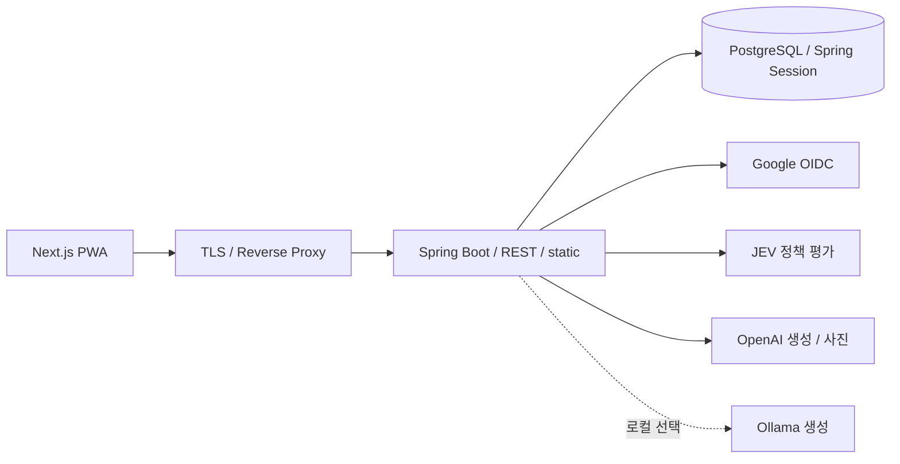

# 소프트웨어 구조와 경계

단일 Spring Boot 배포 단위의 Modular Monolith다. Next.js의 정적 PWA를 JAR에 포함하고
브라우저는 REST API를 호출한다. 모듈·계층 경계는 Spring Modulith·ArchUnit·Checkstyle로 검증한다.
사용자 기능은 [Product](product.md), AI 처리 계약은 [AI](ai.md), AWS 구성은 [Infrastructure](infrastructure.md)에 둔다.

## 시스템과 배포 단위



Next.js를 별도 Node 서버로 운영하지 않는다. `frontend/out`은 BootJar의
`BOOT-INF/classes/static`에 포함한다. Google은 외부 인증을, Spring Session JDBC는 서버 세션을 담당한다.
실행·빌드 명령은 [Development](../guides/development.md)에 둔다.

## 모듈과 공개 계약

| 모듈 | 책임 |
| --- | --- |
| user | Google OIDC 사용자 식별·인증 컨텍스트 |
| exercise | 기본 운동·사용자 운동·공통 운동 참조 |
| workout | 운동·종목 snapshot·세트·완료 상태 |
| routine | 운동 템플릿과 루틴 기반 운동 시작 |
| body | 측정 시각에 따른 신체 기록 |
| nutrition | 직접 식단 입력·영양 목표·집계 |
| dashboard | 운동·신체 공개 데이터를 조합한 통계 |
| ai | 기록 Context 기반 대화와 사진 분석 |
| common | 공통 기술 설정·HTTP 오류 변환 |

| Consumer → Provider | 허용 Named Interface |
| --- | --- |
| workout → exercise | catalog, domain-model |
| routine → exercise | catalog, domain-model |
| routine → workout | routine-api |
| dashboard → workout / body | insight |
| ai → workout / body / nutrition | insight |

`package-info.java`의 `allowedDependencies`와 `@NamedInterface`가 공개 범위를 정의한다.
다른 모듈의 Service·Repository·내부 패키지를 직접 사용하지 않는다.
운동 시작 결과와 화면 조회가 즉시 필요하므로 공개 In Port를 동기 호출한다.
후속 작업의 비동기 event·재시도·중복 처리 프레임워크는 현재 도입하지 않았다.

## 모듈 내부 패키지

```text
<module>/
├── presentation/
│   ├── controller/
│   └── dto/request/, dto/response/
├── application/
│   ├── port/in/, port/out/
│   ├── dto/request/, dto/response/
│   ├── service/
│   └── support/
├── domain/model/, domain/exception/
└── infrastructure/
    ├── persistence/
    ├── module/
    └── client/
```

실제로 필요한 패키지만 만든다. Application의 설정·예외는 별도 역할 패키지를 사용할 수 있다.

| 위치 | 책임·허용 경계 |
| --- | --- |
| Presentation | HTTP 입력 검증·응답 변환, In Port 호출 |
| Application Service | 유스케이스 순서와 transaction 경계 |
| Application Support | Context·prompt·policy·history 등 응집된 내부 협력 기능, Service 역참조 금지 |
| Domain | 비즈니스 규칙과 모델, 외부 계층 의존 금지 |
| Out Port | 저장소·외부 연동 계약, Spring Data·Adapter 구현 의존 금지 |
| Infrastructure persistence | 자신의 DB 저장·조회, Spring Data interface와 Out Port 구현 Adapter |
| Infrastructure module | 다른 모듈의 공개 In Port 호출 Adapter |
| Infrastructure client | 외부 HTTP·SDK·파일 처리·wire 검증 |

query/command Service를 별도로 강제하지 않는다. `insight`는 공개 조회 계약이며
자신의 조회인지 타 모듈 조회인지에 따라 persistence 또는 module 구현으로 구분한다.
JEV 정책 client와 Spring AI 답변 client는 역할이 다르지만 동일한 client 분류 안에 둔다.
인증·설정·초기 데이터의 security/config/bootstrap은 별도 책임 패키지로 유지한다.
Spring Data Repository와 Adapter는 같은 persistence에 두고 Repository의 package-private 접근을 유지한다.
패키지를 분리하려고 기술 interface를 public으로 노출하지 않는다.

## DTO와 책임 분리

Application 입력은 `dto/request`의 Command, 출력은 `dto/response`의 Result로 표현한다.
HTTP DTO는 Presentation에 둔다. Controller는 Service·Support 구현을 직접 호출하지 않는다.
Port의 중첩 record는 공개 계약의 일부이므로 별도 DTO로 분리하지 않는다.
Response DTO·HTTP·In Port에 JPA Entity를 직접 노출하지 않는다.
허용된 Application DTO 전달·변환을 모든 레이어 간 DTO 접근 금지로 확대하지 않는다.

순수한 생성·변환은 해당 DTO의 factory 메서드에 둔다. JSON 해석처럼 별도 협력이 필요한 변환은
구체 Support mapper가 맡는다. 최소 구현을 이유로 독립적인 변경 책임을 한 Service에 합치지 않는다.
통계·목표 차감·빈도 집계 같은 계산 책임은 Builder·Assembler·Service에 유지한다.
보조 기능은 의미 있는 메서드나 응집된 구체 클래스로 분리하고 한 줄에 선언·대입을 압축하지 않는다.
Java `var` 선언은 가독성 컨벤션으로 금지하며 이름·주석·문자열의 var까지 금지하지 않는다.

현재 규모에서는 Domain Entity에 JPA mapping annotation을 허용한다.
동일한 Domain/Persistence Entity를 별도로 복제하지 않는다.

## 트랜잭션과 데이터 경계

DB를 사용하는 In Port 구현 Service는 기본 read-only 경계와 쓰기 메서드의 transaction을 명시한다.
Repository의 암묵적 transaction만으로 유스케이스 경계를 대신하지 않는다.
외부 AI 호출은 NOT_SUPPORTED 경계에서 실행하고 앞뒤 저장을 별도 짧은 transaction으로 나눈다.
텍스트 조율은 `AiChatMessageService`, 사진 조율은 `FoodPhotoService`, 저장은 각각의 transaction Service가 맡는다.
Support가 저장 Service를 역참조하지 않는다.

JPA Entity는 transaction 안에서 Result projection으로 변환한다.
`open-in-view=false`, `hibernate.ddl-auto=none`을 유지하고 schema·세션 테이블 변경은 Flyway로 관리한다.
과거 migration을 덮어쓰지 않는다. schema 복구는 [배포 가이드](../guides/deployment.md#v11-schema와-복구)를 따른다.

운동·루틴은 카탈로그 이름·카테고리 snapshot으로 과거 기록을 보존한다.
식단은 직접 입력값을 저장하며 일괄 등록 전체를 하나의 쓰기 transaction으로 처리한다.
영양소의 null은 미입력, 0은 알려진 값으로 구분한다. 화면 동작은 Product를 따른다.

## 검사의 책임

| 검사 | 강제하는 것 |
| --- | --- |
| ModulithArchitectureTest | 모듈 의존·순환·공개 API·허용 목록 |
| LayerArchitectureTest | 내부 의존 방향·Port 계약·Support 역참조·Presentation 구현 참조 금지 |
| PersistenceBoundaryArchitectureTest | Entity 비노출·JPA 배치·기본 transaction 선언 |
| ComponentConventionTest | Spring 컴포넌트·역할 패키지·Command/Result 위치 |
| Checkstyle Main/Test | Java AST의 var 타입 선언 금지 |
| JavaConventionTest / ArchitectureRuleDetectionTest | 정상·금지 fixture와 규칙 자체의 탐지 능력 |
| EntityBoundaryApiIntegrationTest | 테스트 transaction 없이 실제 요청 종료 후 projection 조회 |

실행 명령과 동작 테스트 기준은 [Testing](../guides/testing.md)에 둔다.
규칙을 통과하려고 허용 의존성·예외·기준선을 임의로 완화하지 않는다.

`modulithDocs`는 `build/spring-modulith-docs`에 Backend 모듈 관계와 canvas를 생성한다.
생성물을 일반 테스트에 섞거나 이 문서의 외부 시스템 설명을 대체하지 않는다.
