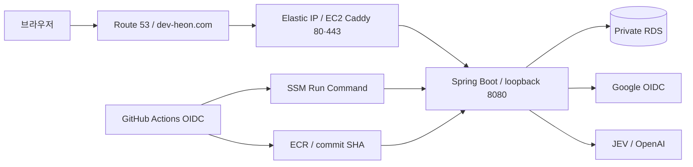

# 인프라·설정 계약

저장소의 CDK·배포 스크립트가 정의하는 구성이다. 실제 AWS의 배포 상태는 이 문서만으로 증명하지 않는다.
실행 순서는 [Deployment](../guides/deployment.md), 상태·로그 확인은 [Troubleshooting](../guides/troubleshooting.md)을 따른다.

## 요청과 배포 경로

## 리소스와 경계

| 대상 | 코드가 정의하는 값 |
| --- | --- |
| Region / VPC | ap-northeast-2, 10.20.0.0/16, 2 AZ |
| Subnet | Public application + Private Isolated database, NAT 없음 |
| EC2 | t4g.micro ARM64 / Amazon Linux 2023, encrypted gp3 20 GiB, swap 2 GiB |
| RDS | PostgreSQL 17.9 / db.t4g.micro / Single-AZ, encrypted gp3 20 GiB, 최대 50 GiB, backup 7일 |
| 네트워크 | 인터넷 ingress 80·443만, app 127.0.0.1:8080, RDS 5432는 EC2 Security Group에서만 |
| ECR | my-fitness, immutable SHA tag, scan on push, 최근 10개 유지 |
| 애플리케이션 | my-fitness-app, memory 700m, restart unless-stopped |
| JVM / Hikari | Xms128m·Xmx512m·G1GC, pool max 5 / min idle 1 |
| HTTPS | Caddy host network, Let's Encrypt, reverse proxy loopback 8080 |

EC2 관리는 SSM을 사용한다. ALB·ECS·EKS·ASG는 구성하지 않는다.
CDK stack은 MyFitnessNetwork → MyFitnessDatabase → MyFitnessApplication → MyFitnessCicd 순서로 의존한다.
Route 53 record와 Caddy 실행은 stack 밖에서 관리한다. Amazon Linux bootstrap은 Docker·jq·AWS CLI·runtime 디렉터리와 swap을 준비하며 curl-minimal과 충돌하는 full curl을 추가하지 않는다.

## 설정과 비밀값

CDK가 만드는 Parameter Store는 `/my-fitness/prod/instance-id`, `ecr-repository-uri`, `db-host`, `db-secret-arn`이다.
다음 표는 사용자가 관리하는 `/my-fitness/prod/` 아래 parameter와 배포 시 환경 변수 연결이다.

| Parameter suffix | 타입 | 환경 변수 / 계약 |
| --- | --- | --- |
| google-client-id | String | GOOGLE_CLIENT_ID, 로그인 설정 |
| google-client-secret | SecureString | GOOGLE_CLIENT_SECRET |
| openai-api-key | SecureString | OPENAI_API_KEY, OpenAI 사용 시 필요 |
| app-base-url | String | FRONTEND_ORIGIN·LOGIN_SUCCESS_URL, 설정 시 SESSION_COOKIE_SECURE=true |
| ai-provider | String | AI_PROVIDER, 미설정 none, 사진 분석은 openai 필요 |
| typesafe-api-key | SecureString | TYPESAFE_API_KEY, 배포 preflight 필수 |
| ai-policy-model | String | AI_POLICY_MODEL, ParameterNotFound일 때 jev-1.13.0 |
| ai-policy-version | String | AI_POLICY_VERSION, ParameterNotFound일 때 fitness-policy-v1 |

JEV 키 누락·빈 값과 정책 parameter의 SSM 접근 실패는 실행 중 컨테이너·환경 파일 교체 전에 배포를 중단한다.
모델·버전은 ParameterNotFound만 기본값으로 처리한다. 고객 관리 KMS 키를 쓰면 EC2 role의 decrypt 권한도 필요하다.
AI_POLICY_MODE·TYPESAFE_MODEL과 과거 ai-policy-mode parameter는 현재 코드에서 읽지 않는다.
과거 DB 로그의 mode 값 보존과 운영 경로 선택 제거는 별개다.

RDS username/password는 RDS가 생성한 Secrets Manager secret에서 읽는다.
배포 스크립트는 `/opt/my-fitness/runtime.env`를 권한 600으로 만들고 컨테이너에 전달한다.
키·환경 파일·DB 비밀번호를 로그나 문서에 출력하지 않는다.

### 앱 환경 기본값

| 설정 | 기본값 / 범위 |
| --- | --- |
| DB_URL | jdbc:postgresql://localhost:5432/my_fitness, 로컬 개발 기본값 |
| GOOGLE_CLIENT_ID / SECRET | 미설정은 not-configured, 실제 로그인에는 유효한 값 필요 |
| LOGIN_SUCCESS_URL / FRONTEND_ORIGIN | http://localhost:3000 |
| AI_PROVIDER | none; openai·ollama는 서버 환경으로 선택 |
| AI_OPENAI_MODEL / AI_REQUEST_TIMEOUT | gpt-4o-mini / 30s, 재시도 0회 |
| OLLAMA_BASE_URL / AI_OLLAMA_MODEL | http://localhost:11434 / qwen3:1.7b |
| AI_POLICY_MODEL / AI_POLICY_VERSION | jev-1.13.0 / fitness-policy-v1 |
| AI_POLICY_TIMEOUT | 1500ms |
| multipart | file 5 MiB / request 6 MiB |

정책 임계값·판정 순서·사진 응답 계약은 [AI Reference](ai.md)에 둔다.
배포 스크립트는 AI_OPENAI_MODEL·AI_REQUEST_TIMEOUT·정책 timeout/임계값을 SSM에서 별도로 조회하지 않는다.
다른 값을 운영에 적용하려면 환경 파일 생성 계약도 함께 변경해야 한다.
로컬 `.env`는 Spring Boot가 자동으로 읽지 않는다.

## 배포와 관측의 범위

main의 CI 성공 후 AWS_DEPLOY_ROLE_ARN 변수가 있으면 Deploy App이 실행되며 workflow_dispatch도 지원한다.
ECR에 같은 SHA가 있으면 이미지를 재사용한다. SSM은 새 이미지 실행·health 확인을 수행하고 실패 시 이전 이미지 실행을 시도한다.
이 복구는 DB schema 복원을 포함하지 않는다. 자세한 절차는 [Deployment](../guides/deployment.md)에 둔다.

CloudWatch 기본 EC2/RDS metrics와 RDS PostgreSQL log export, Docker stdout/stderr와 Actions/SSM 기록을 확인할 수 있다.
CloudWatch Agent IAM 권한만으로 앱 Docker 로그 수집이 활성화되지는 않는다. 해당 설치·설정은 현재 배포 구성에 없다.

Prometheus·Grafana는 [로컬 학습용 Compose](../guides/monitoring.md)다. CI의 Compose 검사는 GitHub runner에서 수행하고 EC2에 설치하지 않는다.
prod는 monitoring 프로필을 활성화하지 않는다. 운영 수집·로그 중앙화·외부 알림·자원·비용은 별도 결정 대상이다.
음식 사진에도 S3·CDN·원본 저장 테이블·별도 키를 추가하지 않는다.

구현 근거: [CDK](../../infra/), [app 설정](../../src/main/resources/application.yml),
[CI](../../.github/workflows/ci.yml), [Deploy App](../../.github/workflows/deploy-app.yml), [EC2 script](../../scripts/deploy-ec2.sh).
