# 인프라·설정 계약

저장소의 CDK·배포 스크립트가 정의하는 구성이다. 실제 AWS의 배포 상태는 이 문서만으로 증명하지 않는다.
실행 순서는 [Deployment](../guides/deployment.md), 상태·로그 확인은 [Troubleshooting](../guides/troubleshooting.md)을 따른다.

## 요청과 배포 경로

```mermaid
flowchart LR
    Browser[브라우저] --> DNS[Route 53 / dev-heon.com]
    DNS --> Caddy[Elastic IP / EC2 Caddy 80·443]
    Caddy --> App[Spring Boot / loopback 8080]
    App --> RDS[(Private RDS)]
    App --> Google[Google OIDC]
    App --> AI[JEV / OpenAI]
    GitHub[GitHub Actions OIDC] --> ECR[ECR / commit SHA]
    GitHub --> SSM[SSM Run Command]
    SSM --> App
    ECR --> App
```

## 리소스와 경계

| 대상 | 코드가 정의하는 값 |
| --- | --- |
| Region / VPC | ap-northeast-2, 10.20.0.0/16, 2 AZ |
| Subnet | Public application + Private Isolated database, NAT 없음 |
| EC2 | t4g.small ARM64 / Amazon Linux 2023, encrypted gp3 20 GiB, swap 2 GiB |
| RDS | PostgreSQL 17.9 / db.t4g.micro / Single-AZ, encrypted gp3 20 GiB, 최대 50 GiB, backup 7일 |
| 네트워크 | 인터넷 ingress 80·443만, app 127.0.0.1:8080, RDS 5432는 EC2 Security Group에서만 |
| ECR | my-fitness, immutable SHA tag, scan on push, 최근 10개 유지 |
| 애플리케이션 | my-fitness-app, memory 448m / memory-swap 512m, restart unless-stopped |
| JVM / Hikari | Xms64m·Xmx256m·G1GC, pool max 5 / min idle 1 |
| HTTPS | Caddy host network, memory 64m, Let's Encrypt, health 외 actuator 404 |
| 운영 수집 | Prometheus 256m, Grafana 512m, Alertmanager 64m, node_exporter 32m, swap 추가 사용 없음 |

EC2 AMI는 서울의 기존 `ami-093fb7e528aec34e5`로 고정한다. 타입 증설에서 최신 AMI 조회로
인스턴스가 교체되지 않게 하며, AMI 교체는 별도 변경 집합·디스크 보존 검토를 거친다.
EC2 관리는 SSM을 사용한다. ALB·ECS·EKS·ASG는 구성하지 않는다.
CDK stack은 MyFitnessNetwork → MyFitnessDatabase → MyFitnessApplication → MyFitnessCicd 순서로 의존한다.
Route 53 record와 Caddy 실행은 stack 밖에서 관리한다. Amazon Linux bootstrap은 Docker·jq·AWS CLI·runtime 디렉터리와 swap을 준비하며 curl-minimal과 충돌하는 full curl을 추가하지 않는다.

## 설정과 비밀값

CDK가 만드는 Parameter Store는 `/my-fitness/prod/instance-id`, `ecr-repository-uri`, `db-host`, `db-secret-arn`이다.
다음 표는 사용자가 관리하는 `/my-fitness/prod/` 아래 parameter와 배포 시 환경 변수 연결이다.

| Parameter suffix | 타입 | 환경 변수 / 계약 |
| --- | --- | --- |
| google-client-id | String | GOOGLE_CLIENT_ID, 로그인 설정 |
| google-client-secret | SecureString | GOOGLE_CLIENT_SECRET |
| openai-api-key | SecureString | OPENAI_API_KEY, OpenAI 사용 시 필요 |
| app-base-url | String | FRONTEND_ORIGIN·LOGIN_SUCCESS_URL, 설정 시 SESSION_COOKIE_SECURE=true |
| ai-provider | String | AI_PROVIDER, 미설정 none, 사진 분석은 openai 필요 |
| typesafe-api-key | SecureString | TYPESAFE_API_KEY, 배포 preflight 필수 |
| ai-policy-model | String | AI_POLICY_MODEL, ParameterNotFound일 때 jev-1.13.0 |
| ai-policy-version | String | AI_POLICY_VERSION, ParameterNotFound일 때 fitness-policy-v1 |
| monitoring-password | SecureString | APP_MONITORING_PASSWORD·Prometheus password_file, 필수·동일 값 |
| grafana-admin-password | SecureString | Grafana 첫 DB 초기화의 admin 암호, 필수 |
| slack-webhook-url | SecureString | Alertmanager Incoming Webhook URL 파일, 필수 |

JEV 키 누락·빈 값과 정책 parameter의 SSM 접근 실패는 실행 중 컨테이너·환경 파일 교체 전에 배포를 중단한다.
모델·버전은 ParameterNotFound만 기본값으로 처리한다. 고객 관리 KMS 키를 쓰면 EC2 role의 decrypt 권한도 필요하다.
AI_POLICY_MODE·TYPESAFE_MODEL과 과거 ai-policy-mode parameter는 현재 코드에서 읽지 않는다.
과거 DB 로그의 mode 값 보존과 운영 경로 선택 제거는 별개다.

RDS username/password는 RDS가 생성한 Secrets Manager secret에서 읽는다.
배포 스크립트는 `/opt/my-fitness/runtime.env`를 권한 600으로 만들고 컨테이너에 전달한다.
운영 release는 app-base-url의 HTTPS 도메인이 필요하며 `prod,monitoring`을 활성화한다.
비밀값은 `/opt/my-fitness/monitoring/secrets`의 700 디렉터리·600 파일로 준비한다.
Prometheus·Grafana·Alertmanager credential volume은 각각 분리하며 UID 65534·472·65534 소유 파일만 읽는다.
키·환경 파일·DB 비밀번호를 로그나 문서에 출력하지 않는다.

### 앱 환경 기본값

| 설정 | 기본값 / 범위 |
| --- | --- |
| DB_URL | jdbc:postgresql://localhost:5432/my_fitness, 로컬 개발 기본값 |
| GOOGLE_CLIENT_ID / SECRET | 미설정은 not-configured, 실제 로그인에는 유효한 값 필요 |
| LOGIN_SUCCESS_URL / FRONTEND_ORIGIN | http://localhost:3000 |
| AI_PROVIDER | none; openai·ollama는 서버 환경으로 선택 |
| AI_OPENAI_MODEL / AI_REQUEST_TIMEOUT | gpt-4o-mini / 30s, 재시도 0회 |
| OLLAMA_BASE_URL / AI_OLLAMA_MODEL | http://localhost:11434 / qwen3:1.7b |
| AI_POLICY_MODEL / AI_POLICY_VERSION | jev-1.13.0 / fitness-policy-v1 |
| AI_POLICY_TIMEOUT | 1500ms |
| multipart | file 5 MiB / request 6 MiB |

정책 임계값·판정 순서·사진 응답 계약은 [AI Reference](ai.md)에 둔다.
배포 스크립트는 AI_OPENAI_MODEL·AI_REQUEST_TIMEOUT·정책 timeout/임계값을 SSM에서 별도로 조회하지 않는다.
다른 값을 운영에 적용하려면 환경 파일 생성 계약도 함께 변경해야 한다.
로컬 `.env`는 Spring Boot가 자동으로 읽지 않는다.

## 배포와 관측의 범위

main의 CI 성공 후 AWS_DEPLOY_ROLE_ARN 변수가 있으면 Deploy App이 실행되며 workflow_dispatch도 지원한다.
ECR에 같은 SHA가 있으면 이미지를 재사용한다. 검증 SHA의 설정 archive도 SSM으로 전달한다.
`deploy-ssm.sh`는 해당 Git commit에서 운영 실행 파일만 선택하며 local 설정·테스트 소스를 배포하지 않는다.
Grafana dashboard provider와 경보 규칙은 공통 파일을 사용하고, 환경별 수집·datasource 설정은
`.local.yml`·`.prod.yml`로 구분한다. Compose는 환경별 설정 한 파일을 컨테이너의 표준 경로에 마운트한다.
SSM은 secret·swap·자원·이미지·설정 preflight와 공개 지표 차단 뒤 새 앱을 실행한다.
앱 health 실패 시 이전 이미지·환경·RAM/swap 한도를 함께 복구한다.
이 복구는 DB schema 복원을 포함하지 않는다. 자세한 절차는 [Deployment](../guides/deployment.md)에 둔다.

CloudWatch 기본 EC2/RDS metrics와 RDS PostgreSQL log export, Docker stdout/stderr와 Actions/SSM 기록을 확인할 수 있다.
CloudWatch Agent IAM 권한만으로 앱 Docker 로그 수집이 활성화되지는 않는다. 해당 설치·설정은 현재 배포 구성에 없다.

로컬은 기존 15초·30일/2GB Compose를 유지한다. 운영은 별도 Compose의 Linux host network와
loopback 9090·3001·9093·9100을 사용한다. SG 포트를 추가하지 않고 Grafana는 SSM 터널로 접근한다.
운영 수집/평가는 60초, 보관은 3일/1GB, Grafana refresh는 1분이다. WAL·head 때문에 1GB를 초과할 수 있다.
기존 6개 규칙과 host 메모리/디스크 2개 규칙은 Prometheus가 평가하고 Alertmanager가 Slack에 전달한다.
Docker 로그는 local driver 10m×3이며 앱 로그의 CloudWatch 중앙 수집은 추가하지 않는다.
모니터링 실패는 앱 배포 성공과 분리해 보고하며 설정 rollback은 volume을 보존한다.
현재 small·20GiB의 초기 한도이며 24시간 자원 인수 전 상시 운영 가능하다고 판단하지 않는다.
현재 실행 방법·중단·비용과 인수 기준은 [Monitoring](../guides/monitoring.md),
설계 근거와 미검증 범위는 [스펙](../changes/2026/2026-10-06-single-ec2-monitoring/spec.md)에 둔다.
음식 사진에도 S3·CDN·원본 저장 테이블·별도 키를 추가하지 않는다.

구현 근거: [CDK](../../infra/), [app 설정](../../src/main/resources/application.yml),
[CI](../../.github/workflows/ci.yml), [Deploy App](../../.github/workflows/deploy-app.yml), [EC2 script](../../scripts/deploy-ec2.sh).
