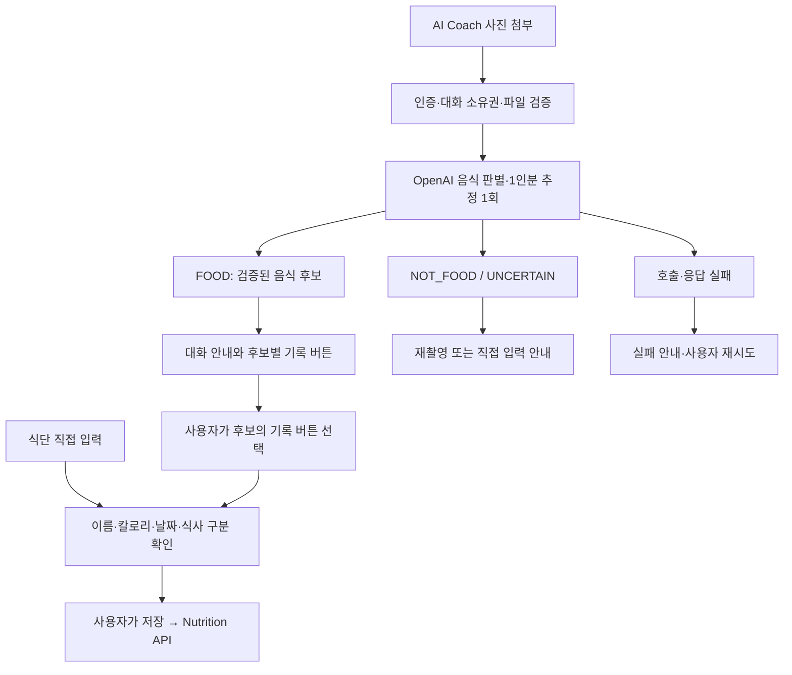

# PR-013 음식 사진 분석과 직접 식단 기록

> 작성일: 2026-10-01 (목요일)
> 상태: 구현 기준 설계 계약 · 완료 결과는 현재 상태 문서와 보고에서 확인
> PR 번호: 예정 번호 013, 실제 PR 생성 시 조정
> 대상: Nutrition, AI Coach, Frontend, DB schema, 구현 이후 현재 상태 문서
> 작업 위치: 기존 `main`, 별도 worktree 생성 없음

## 1. 배경과 목표

현재 식단 기록은 사용자 소유 Food를 등록하고, 해당 foodId와 섭취 회분을 선택해 MealFood에 영양 snapshot을 저장한다. 음식 등록 과정과 Food 의존을 제거하고 음식명 문자열·칼로리를 바로 입력하는 흐름으로 바꾼다.

음식 사진을 AI Coach에 첨부하면 음식 여부를 확인하고, 식별 가능한 음식의 일반적인 1인분 칼로리를 추정한다. 사용자가 결과의 **식단에 기록하기** 버튼을 선택하면 음식명·칼로리를 식단 입력 화면에 채운다. 날짜·식사 구분·내용을 확인하거나 수정한 뒤 사용자가 저장한다. AI는 식단을 자동 저장하지 않는다.

성공 기준:

- Food 사전 등록 없이 식단 생성·수정·삭제가 가능하다.
- 사진 결과에서 식단 입력까지 이름과 칼로리를 다시 타이핑하지 않아도 된다.
- 비음식·식별 불가·분석 장애에는 추정값과 기록 액션을 제공하지 않는다.
- 칼로리는 필수이고 탄단지는 선택 입력이며 처음에는 접혀 있다.
- 일반 대화의 JEV 정책 경계와 기존 모듈·계층·트랜잭션 경계를 유지한다.

## 2. 현재 구현과 변경 대상

| 영역 | 현재 구현 | 목표 계약 |
| --- | --- | --- |
| 음식 관리 | Food Entity, FoodService, `/api/foods`, 음식 관리 화면 | 운영 코드·API·화면과 foods 테이블 제거 |
| 식단 입력 | foodId와 servings 필수 | 이름 문자열·최종 기록 칼로리·선택 탄단지 |
| 식단 항목 수정 | servings만 수정 | 이름·칼로리·탄단지 수정, 날짜·식사 구분 변경도 지원 |
| 영양 합계 | 모든 영양값 필수, 회분 곱셈 | 실제 기록값 합산, 미입력과 0 구분 |
| AI 입력 | JSON 텍스트 메시지만 지원 | 기존 텍스트 API 유지, 사진 전용 multipart API 추가 |
| AI 결과 | 대화문만 저장 | 사진의 검증된 구조화 결과와 고정 안내도 저장 |
| 화면 이동 | AppShell view state | 기록 초안을 AppShell에서 NutritionScreen에 전달 |
| 데이터 | V5 Food/Meal/MealFood/NutritionGoal | 카탈로그 없는 Meal/MealFood/NutritionGoal |

근거: `MealItemCreateRequest`, `MealFood`, `NutritionApplicationService`, `NutritionResultAssembler`, `NutritionInsightService`, `AiChatGateway`, `SpringAiChatGateway`, `AiMessage`, `AppShell`, `nutrition-screen.tsx`, `ai-coach.tsx`.

기존 PR-008·PR-009 문서는 구현 당시의 이력이다. 과거 스펙을 덮어쓰지 않고 이번 변경 계약을 본 문서에 둔다. 현재 운영 JEV 텍스트 계약은 [PR-012](2026-09-29-tue-pr-012-jev-single-path.md)를 따른다.

## 3. 확정한 범위와 제외 범위

### 포함

- 음식명 직접 입력과 음식 카탈로그 제거.
- AI Coach의 음식 사진 첨부·분석·대화 결과·기록 액션.
- 사진 후보별 일반적인 1인분 추정값, 여러 음식의 후보 선택.
- 날짜·식사 구분의 현재 한국 시간 기본값과 사용자 수정.
- 접힌 선택 탄단지 입력과 미입력 영양 집계.
- 외부 응답 검증·실패 계약·소유권·파일 검증.
- 데이터 없는 환경을 전제로 한 최소 후속 schema migration.
- 일반 빌드·컨벤션·아키텍처·기능 검증, 구현 이후 현재 상태 Markdown 갱신.

### 제외

- Food의 자동 생성, 카탈로그 검색·CRUD·음식 관리 탭.
- 실제 사진 속 중량·실제 섭취 열량의 확정, 여러 음식의 자동 합산.
- 사진에서 탄단지 자동 추정, 질병 식단 처방, 사진을 이용한 일반 상담.
- 영양 DB·RAG·인터넷 검색·범용 Tool Calling.
- 원본 사진의 영구 저장, S3·이미지 CDN·업로드 관리 시스템.
- 자동 식단 저장, 자동 provider fallback·재시도.
- 기존 데이터 이전·과거 Food 호환 API·카탈로그를 유지하기 위한 숨은 Food.
- AWS 직접 변경·배포, 별도 요청 없는 commit/push.

## 4. 사용자 흐름



### 4.1 직접 입력

1. 식단 기록 입력 폼을 연다.
2. 현재 시각의 날짜·식사 구분을 채운다.
3. 음식명과 칼로리를 입력한다. 같은 이름을 여러 번 기록할 수 있다.
4. 필요한 경우에만 **영양정보 추가 입력**을 펼쳐 탄단지를 입력한다.
5. 사용자 저장 시에만 식단 생성 API를 호출한다. 직접 입력은 AI를 호출하지 않는다.

### 4.2 사진 분석

1. AI Coach에서 사진 한 장을 선택한다. 전송 전 미리보기·교체·취소를 제공한다.
2. 서버가 사진 파일과 대화 소유권을 검증한 뒤 모델을 한 번 호출한다.
3. 식별된 후보의 이름·기준 분량·추정 칼로리와 추정 안내를 대화에 표시한다.
4. 사용자가 후보의 **식단에 기록하기**를 누르면 AI 패널을 닫고 식단 기록 폼을 연다.
5. 선택 후보의 이름과 칼로리만 초안에 넣는다. 탄단지는 비워 두고 영양 입력은 접힌 상태다.
6. 날짜·식사 구분은 버튼 선택 시점의 현재 시각으로 정한다. 분석 시작 시각이나 과거 조회 날짜를 자동 적용하지 않는다.
7. 사용자가 수정하고 저장한다. 버튼을 누르는 것 자체는 저장·자동 재분석을 수행하지 않는다.

### 4.3 시간 기본값

한국 시간 `Asia/Seoul` 기준으로 입력 화면을 여는 순간에 한 번 채운다. 편집 중 시간이 바뀌어도 사용자의 입력을 덮어쓰지 않는다.

| 현재 시각 | 기본 식사 구분 |
| --- | --- |
| 05:00 이상 ~ 10:00 미만 | BREAKFAST / 아침 |
| 10:00 이상 ~ 15:00 미만 | LUNCH / 점심 |
| 15:00 이상 ~ 21:00 미만 | DINNER / 저녁 |
| 21:00 이상 또는 05:00 미만 | SNACK / 간식 |

기본값은 추천이며 사용자는 어느 시각에도 다른 구분을 선택할 수 있다. 저장 필드의 날짜·식사 구분은 반드시 클라이언트 요청으로 받는다. 서버가 사용자 입력을 시간 기준으로 재분류하지 않는다. 미래 날짜 금지 검증도 한국 날짜를 사용해 서버·브라우저 시간대 차이를 없앤다.

기존 항목 편집은 저장된 날짜·구분을 보여준다. 날짜·구분을 바꾸면 해당 사용자·날짜·구분의 Meal로 항목을 이동하고 원래/새 Meal의 변경 시각을 갱신한다.

### 4.4 기준 분량과 칼로리 의미

사진은 음식 종류를 식별하고 **일반적인 1인분** 기준 칼로리를 추정한다. 사진 속 실제 양을 측정했다고 표현하지 않는다. `servingDescription`에 `일반적인 1그릇`, `보통 크기 1개`처럼 가정을 표시한다.

식단 폼의 `calories`는 최종 저장할 섭취 칼로리다. 사진의 `caloriesPerServing`을 초기값으로 넣고, 사용자가 먹은 양에 맞춰 변경한다. 기존 servingAmount/servingUnit/servings와 자동 곱셈을 제거해 두 값이 이중으로 반영되지 않도록 한다. 탄단지도 최종 기록량(g)이다.

기록 폼에 사진 추정값이 채워졌을 때는 저장 전에 수정할 수 있다는 안내를 표시한다. 음식 DB를 조회하지 않았으므로 공식 영양정보·정확한 열량·검증된 평균값으로 표시하지 않는다.

## 5. Nutrition 데이터·API 계약

### 5.1 저장 모델

Meal은 사용자·날짜·식사 구분의 기존 고유 제약을 유지한다. MealFood는 식단 항목을 의미하며 이름 변경만을 위한 Entity/Table 분리는 하지 않는다.

| MealFood 필드 | 필수 여부 | 규칙 |
| --- | --- | --- |
| id / meal | 필수 | 기존 식별·소유권 경계 유지 |
| foodName | 필수 | trim 후 1~100자, 중복 이름 허용 |
| calories | 필수 | 0 이상 ~ 999999.99 이하, 소수 둘째 자리까지 |
| carbohydrateGrams | 선택 | null 또는 0 이상 ~ 999999.99 이하 |
| proteinGrams | 선택 | null 또는 0 이상 ~ 999999.99 이하 |
| fatGrams | 선택 | null 또는 0 이상 ~ 999999.99 이하 |
| createdAt / updatedAt | 필수 | 서버 생성 |

sourceFoodId, servingAmount, servingUnit, perServing 영양 컬럼, servings는 현재 계약에서 제거한다. 미입력 값을 `0`이나 빈 문자열로 DB에 넣지 않는다. 입력값은 BigDecimal로 처리한다.

NutritionGoal의 기존 설정 API·값은 유지한다. 목표가 없어도 식단 기록은 가능하며 새 목표 등록을 저장의 선행 조건으로 만들지 않는다.

### 5.2 식단 생성·수정

```text
POST   /api/meals/items
PATCH  /api/meals/items/{itemId}
DELETE /api/meals/items/{itemId}
GET    /api/meals/daily?date=YYYY-MM-DD
```

POST와 PATCH는 아래 전체 편집 값을 받는다. PATCH에서도 null 탄단지는 해당 값을 미입력으로 바꾸는 의미다. 일부 필드만 추측해서 갱신하지 않는다.

```json
{
  "mealDate": "2026-10-01",
  "mealType": "LUNCH",
  "foodName": "사용자가 입력한 음식명",
  "calories": 500.00,
  "carbohydrateGrams": null,
  "proteinGrams": 20.00,
  "fatGrams": null
}
```

위 숫자는 wire contract 예시이며 특정 음식의 영양 근거가 아니다.

응답은 `id`, `mealDate`, `mealType`, `foodName`, `calories`, 선택 탄단지, `createdAt`, `updatedAt`을 제공한다. 날짜·구분을 포함해 편집 폼을 구성할 수 있게 한다. 별도의 Food나 sourceFoodId를 반환하지 않는다.

기존 모든 `/api/foods` endpoint를 제거한다. 프론트엔드·테스트·Insight에서 FoodService/Repository/API를 참조하지 않는다.

### 5.3 영양 합계와 미입력

- 칼로리는 모든 항목의 최종 기록값을 합산한다.
- 영양소별로 해당 범위의 항목 모두 값이 있을 때만 완전한 합계 숫자를 제공한다.
- 한 항목이라도 해당 영양소가 null이면 그 영양소의 합계와 목표 대비 remaining은 null이다. 다른 영양소는 독립적으로 계산한다.
- 빈 식사·기록 없는 날짜의 합계는 0이다. 0을 명시 입력한 기록도 알려진 0이다.
- 완전한 합계에서 목표를 초과하면 기존대로 음수 remaining을 허용한다.
- UI는 null에 **미입력 항목 있음**을 표시하고 잔여·초과 수치를 보여주지 않는다. 부분 합계를 전체 섭취량처럼 표시하지 않는다.
- AI Context도 해당 null을 **미입력으로 계산 불가**라고 표현한다. 미확인 값을 근거로 정확한 남은 탄단지를 안내하지 않는다.

NutritionTotals와 공개 MacroInsight는 기존 영양 필드의 nullable 의미를 명확히 유지하고 불필요한 범용 상태 객체를 추가하지 않는다.

최근/자주 먹는 음식 이름은 식단 기록에서 조회한다. 동일한 trim된 이름으로 묶고, 최근순 또는 빈도순·최근순으로 결정적으로 정렬한다. 기존 Insight가 소비하는 이름 목록을 유지하되 새 카탈로그·관리 기능을 만들지 않는다. 프론트엔드의 카탈로그 선택·검색 UI는 제거한다.

## 6. 사진 분석 API와 외부 계약

### 6.1 전용 API

```text
POST /api/ai/conversations/{conversationId}/food-photos
Content-Type: multipart/form-data
part: image (파일 한 장)
```

인증된 Principal의 userId를 사용한다. userId·외부 이미지 URL·임의 prompt·자유 질문을 요청 값으로 받지 않는다. 이 endpoint의 작업은 음식 판별·1인분 추정으로 고정한다. 일반 텍스트 질문은 기존 `/messages` API를 사용한다.

제한값은 제품의 초기 운영 기본값이다:

- 파일 1장, JPEG/PNG만 허용, 5 MiB 이하.
- 디코딩 전 이미지 가로·세로 metadata를 확인해 16,000,000 pixel을 초과하면 거절한다.
- MIME·확장자만 신뢰하지 않고 실제 포맷·이미지 디코딩을 확인한다.
- 프론트엔드는 지원되는 이미지를 종횡비를 유지해 긴 변 최대 1600px로 축소하고 JPEG로 다시 인코딩한다. 파일명·EXIF를 모델 입력이나 보존 자료로 사용하지 않는다.
- 서버도 수신 이미지를 정규화해 metadata를 포함한 원본 byte를 provider에 그대로 전달하지 않는다.
- HEIC/WebP 등 미지원 파일은 JPG/PNG 선택 안내를 반환한다. 지원을 위해 별도 이미지 라이브러리를 먼저 추가하지 않는다.
- multipart request 제한은 파일 제한과 multipart overhead를 구분해 설정한다. 프론트엔드가 FormData의 Content-Type boundary를 직접 지정하지 않는다.

### 6.2 구조화 결과

외부 Gateway와 응답의 핵심 결과:

```json
{
  "status": "FOOD",
  "items": [
    {
      "foodName": "식별한 음식명",
      "servingDescription": "일반적인 1그릇 기준",
      "caloriesPerServing": 500.00
    }
  ]
}
```

| status | items | 앱 동작 |
| --- | --- | --- |
| FOOD | 1~5개, 검증된 후보 | 후보별 안내·기록 버튼 |
| NOT_FOOD | 빈 배열 | 음식 사진 업로드 안내, 액션 없음 |
| UNCERTAIN | 빈 배열 | 재촬영·음식명 직접 입력 안내, 액션 없음 |

최대 후보 수를 넘으면 임의의 일부를 성공 결과로 잘라 쓰지 않고 유효하지 않은 응답으로 처리한다. 사진 전체를 반드시 후보 5개로 채우게 요구하지 않는다. 비음식·모호한 입력은 빈 결과를 반환하도록 schema와 prompt에 명시한다.

모델 출력은 schema 외에 상태/후보 수·이름·분량 설명 길이·유한한 숫자·범위도 검증한다. NOT_FOOD/UNCERTAIN에 후보나 칼로리가 섞이거나 FOOD의 필수 값이 없으면 성공 결과로 사용하지 않는다. 탄단지는 모델에 요구하지 않는다.

외부 문자열 대화·HTML·URL·액션 명령을 그대로 사용자에게 표시하지 않는다. Application에서 검증된 후보로 안내문을 구성하고 Frontend가 고정된 기록 버튼을 렌더링한다. 결과에는 모델이 반환한 confidence를 정답 확률처럼 노출하거나 그 값만으로 음식 여부를 확정하는 임계값을 추가하지 않는다.

### 6.3 대화 저장·조회

전송 성공 응답은 conversation, userMessage, assistantMessage를 제공한다. assistantMessage의 nullable `foodPhotoResult`에 위 검증된 결과를 제공한다. 일반 텍스트 메시지는 이 필드가 null이다. 기존 메시지 목록 조회에서도 같은 값을 반환한다.

사용자 메시지는 서버의 고정 사진 분석 요청 문구이며, 파일 원본·base64·파일명은 저장하지 않는다. Assistant에는 고정 안내와 검증된 구조화 결과를 보존한다. 대화를 다시 열어도 FOOD 후보의 기록 버튼을 사용할 수 있다.

같은 AiMessage 저장 모델에 사진 메시지 종류와 구조화 결과를 위한 최소 컬럼을 추가한다. 사진 기록만을 위한 별도 엔티티·첨부 관리 테이블·범용 action 시스템을 만들지 않는다. 포트·Application 응답 계약과 Domain 저장 객체가 서로 역방향으로 의존하지 않게 한다.

### 6.4 모델·호출 횟수·정책 경계

- OpenAI 이미지 입력 + Structured Outputs를 사용해 한 번의 원격 호출에서 판별과 추정을 받는다.
- 기존 `OPENAI_API_KEY`, `AI_OPENAI_MODEL`, `AI_REQUEST_TIMEOUT`을 재사용한다. 기본 모델은 현재 설정의 `gpt-4o-mini`이며 품질 검증을 통과했다는 의미는 아니다.
- AI_PROVIDER가 openai가 아니거나 지원 설정·키가 없으면 사진 기능을 사용할 수 없음을 반환한다. Ollama나 텍스트 모델로 자동 우회하지 않는다.
- 사진을 보지 않고 음식 여부를 판별할 수는 없다. 비음식에 대해 원격 호출 자체가 0회라는 의미가 아니며, 별도의 칼로리 생성 호출·결과 노출을 하지 않는 계약이다.
- JEV는 이미지 입력을 지원하지 않으므로 사진의 독립 판별기로 쓰지 않는다. 이미지 설명을 JEV에 재평가하는 추가 경로도 만들지 않는다.
- **일반 텍스트 AI 요청은 기존대로 JEV 단일 경로를 반드시 거친다.** 사진 API는 임의 상담을 받지 않는 별도의 고정 작업이다. 정상 텍스트 대화의 우회 경로로 사용하지 않는다.
- 사진 속 문구·파일명·사용자 주장·모델이 읽은 문자열은 untrusted data다. 음식 분석 외 지시 수행, 시스템 지시 공개, 의료 판단·위험 실행 안내를 요구하지 않는다.
- 기존 일반 대화의 JEV·생성 이력에서는 사진 턴을 제외한다. 텍스트만 남은 사진 결과를 다시 원본 사진처럼 해석하지 않는다.

## 7. 책임과 아키텍처

| 책임 | 배치 |
| --- | --- |
| HTTP multipart 수신·요청/응답 DTO | AI Presentation Controller/DTO |
| 대화 소유권·사진 유스케이스 조율·고정 안내 | AI Application In Port/Service |
| 이미지 입력·구조화 분석 외부 계약 | AI Application Out Port |
| OpenAI/Spring AI 연동·외부 schema·파싱 | AI Infrastructure client |
| 이미지 decode·정규화 구현 | AI Infrastructure, 외부 계약 뒤에서 수행 |
| 검증된 결과·메시지·오류 로그 저장 | 기존 AI 저장/트랜잭션 경계 |
| 입력 초안 전달·화면 전환 | Frontend AppShell |
| 식단 검증·저장·합계·수정 | Nutrition In Port/Service/Domain/Infrastructure |

Controller는 In Port를 호출한다. Application은 SDK·Infrastructure 구현을 직접 참조하지 않는다. Domain은 Application의 포트/DTO에 의존하지 않는다. 필요한 구체적인 사진 Out Port만 추가하며 범용 멀티모달 프레임워크·전략·factory를 만들지 않는다.

Nutrition은 AI에 의존하지 않고 AI도 Nutrition의 쓰기 포트를 직접 호출하지 않는다. AI의 기존 nutrition::insight 읽기 공개 경계와 Modulith allowedDependencies를 넓히지 않는다.

외부 호출은 NOT_SUPPORTED 경계에서 수행한다. 소유권 조회·사용자 메시지 기록·결과/실패 기록은 각각 짧은 DB transaction이며 이미지 호출 대기 동안 transaction을 유지하지 않는다.

이미지 파일 형식·size 같은 선검증 오류는 원격 호출과 메시지 쓰기 전에 처리한다. 인증·대화 소유권을 확인한 뒤에만 이미지 정규화와 유료 호출을 진행한다.

## 8. 오류·보존·추적

| 상황 | HTTP/처리 | 기록 액션 |
| --- | --- | --- |
| 미인증·CSRF 실패 | 기존 401/403 계약 | 없음 |
| 대화/식단 소유권 불일치 | 기존 FORBIDDEN / 403 | 없음 |
| 대화/식단 없음 | 기존 NOT_FOUND / 404 | 없음 |
| 음식명·칼로리·날짜 오류 | INVALID_REQUEST 또는 NUTRITION_RULE_VIOLATION / 400 | 저장 안 함 |
| 빈 파일·위조/손상·픽셀 제한 | INVALID_REQUEST / 400 | 없음 |
| 파일/request 크기 초과 | PAYLOAD_TOO_LARGE / 413 | 없음 |
| 미지원 이미지 형식 | UNSUPPORTED_IMAGE / 415 | 없음 |
| NOT_FOOD / UNCERTAIN | 200, 고정 대화 안내와 빈 후보 | 없음 |
| 키/Provider 미설정·통신·timeout·외부 HTTP 실패·잘못된 응답·모델 거절 | 기존 AI_PROVIDER_UNAVAILABLE / 503 | 없음 |

Provider 오류 코드는 CONFIGURATION, TIMEOUT, NETWORK, HTTP 상태, INVALID_RESPONSE 검증 단계, REFUSAL/INCOMPLETE처럼 원인을 구분한다. 원문 body·키·사진 byte는 오류 로그에 기록하지 않는다. 외부 응답을 파싱해 실패한 경우에도 정상 음식 후보로 저장하지 않는다.

사진 요청 종류·provider/model·promptVersion·정상/비음식/모호/실패 결과·token usage·latency를 기존 request log에 필요한 최소 필드로 기록한다. JEV가 사진을 평가한 것처럼 policy model·decision 값을 꾸미지 않는다. 사용량을 모르면 null이며 0으로 대체하지 않는다. 원격 응답이나 구조화 결과를 로그와 메시지에 중복 보존하지 않는다.

원본은 요청 처리 중에만 사용하며 앱의 DB·객체 저장소·로그·정적 리소스에 영구 보관하지 않는다. multipart 임시 파일도 처리 종료 시 정리된다. 공급자 전송 사실과 앱의 원본 비보존을 UI에 안내한다. 공급자 자체 보존 정책까지 앱이 삭제를 보장한다고 표현하지 않는다.

## 9. DB 변경

사용자는 현재 사용 데이터가 없고 기존 관련 테이블 제거가 가능하다고 명시했다. 데이터 backfill이나 호환 Food API는 구현하지 않는다.

- 적용된 V1~V10 migration은 삭제·수정하지 않는다. 데이터 없음과 Flyway 적용 이력 없음은 구분한다.
- 한 개의 최소 후속 migration을 추가한다.
- foods와 기존 meal_foods를 제거하고, 새 직접 입력 구조의 meal_foods를 생성한다. Meal/NutritionGoal은 필요한 기존 구조를 유지한다.
- ai_messages에 사진 메시지 식별·검증된 결과 보존 컬럼을 추가하고, 기존 request log에 사진 작업 식별을 위한 최소 필드를 추가한다.
- schema 변경은 Flyway로만 실행한다. `ddl-auto: none`을 유지한다.
- 실제 DB drop·운영 데이터 초기화·배포는 이 코드 작업에서 실행하지 않는다. migration은 앱 배포 시 적용할 변경 파일이다.
- 이 변경은 이전 이미지와 Nutrition schema가 호환되지 않을 수 있다. 운영 안내에 rollback 조건을 명시하고 schema를 바꾼 뒤 이전 이미지만 실행하는 복구를 보장하지 않는다.

## 10. Frontend 계약

- Nutrition은 요약/목표와 식단 기록만 제공한다. 음식 관리 탭·카탈로그 검색/선택·음식 CRUD 요청을 제거한다.
- 기록 폼에 음식명·칼로리·날짜·식사 구분을 표시한다. 탄단지는 `<details>` 등 접근 가능한 접힘 영역에 두고 생성·편집 모두 기본 닫힘 상태다.
- 빈 숫자 필드는 null, 명시적 0은 0으로 전송한다. 접힘 영역을 닫는 것만으로 입력값을 지우지 않는다.
- AppShell에 기록 초안 전달용 작은 callback/state를 추가한다. URL query에 음식 정보를 넣거나 범용 전역 state 라이브러리를 도입하지 않는다.
- 사진 초안에는 후보 이름·칼로리·기준 분량을 담는다. 폼의 날짜/구분은 현재 시간으로 생성하고, 사용자가 선택한 값은 리렌더/분석 완료로 덮어쓰지 않는다.
- 저장/취소 후 초안을 소비해 다른 화면 진입이나 대화 재조회에서 자동 재입력되지 않게 한다.
- 미리보기 object URL은 교체·취소·완료·unmount에 해제한다. 실패 시 사용자가 파일을 바꾸거나 명시적으로 재시도할 수 있다.
- 일반 API helper가 FormData에 application/json을 지정하지 않도록 수정하고 인증 쿠키·CSRF 처리는 유지한다. 사진에 keepalive를 사용하지 않는다.
- 모든 분석 상태에서 파일 선택·전송 중 상태·오류·결과 버튼을 키보드와 모바일에서 사용할 수 있게 한다.

## 11. 구현 계획과 검증

각 단계는 실패하는 의미 있는 동작 테스트를 먼저 확인한 뒤 최소 코드로 구현한다. 제거되는 Food 기능의 테스트는 새 직접 입력 계약으로 교체하고 관련 없는 아키텍처 규칙을 삭제·완화하지 않는다.

### 단계 1 — 직접 입력 Nutrition

- 테스트: 등록 음식 없이 기록, 이름/칼로리 수정, 날짜·구분 이동, null/0 탄단지 구분, 영양소별 null 합계/remaining, 사용자 격리·미래 날짜.
- 구현: DTO/UseCase/MealService/MealFood/Assembler/Insight, 최소 migration, Food 관련 운영 코드 제거.
- 완료: 음식 등록 의존 없음, 기존 영양 목표·조회 동작 유지, 공개 Insight에서 미확인 값을 정확한 수치로 안내하지 않음.

### 단계 2 — 사진 계약과 대화 보존

- 테스트: FOOD·NOT_FOOD·UNCERTAIN·불일치/잘못된 schema, 모델 거절·timeout·통신, 파일/픽셀 검증, 소유권, transaction 비활성, 일반 대화 이력에서 사진 제외.
- 구현: 사진 In/Out Port, Infrastructure client, 고정 대화문, 검증 결과/로그 보존, multipart endpoint.
- 완료: 원격 호출 최대 1회, 실패/비음식 액션 없음, 원본 미보존, 재조회에서 검증된 결과와 액션 복원.

### 단계 3 — UI와 기록 초안

- 테스트: 시간 경계/한국 날짜, 사진 후보 선택 → 초안 전달, 저장 전 API 미호출, 비음식/모호 버튼 없음, 접힘 탄단지, FormData header/CSRF, 저장·취소 뒤 초안 소비.
- 구현: 음식 관리 UI 제거, 직접 기록/편집 폼, 사진 입력·대화 후보/버튼, AppShell callback.
- 완료: 직접 입력·사진 입력이 같은 기록 폼으로 연결되고 사용자가 최종 저장.

### 단계 4 — 일반 검증과 문서 최신화

Java 21에서 실행한다.

```bash
./gradlew checkstyleMain checkstyleTest test \
  --tests 'com.myfitness.architecture.*' \
  --tests 'com.myfitness.convention.*' --no-daemon
./gradlew test --tests 'com.myfitness.nutrition.*' --tests 'com.myfitness.ai.*' --no-daemon
./gradlew build --no-daemon
```

Frontend의 기존 lint/build와 추가한 순수 입력·시간·액션 동작 검사를 실행한다. frontend 테스트 도구가 없으면 기존 Node 런타임의 최소 실행 가능한 검사를 우선하고, 별도 범용 테스트 프레임워크를 검증 목적 없이 추가하지 않는다.

DB 검증은 새 설치(V1~신규)와 적용된 V10 이후 후속 migration을 구분한다. H2 테스트는 실제 PostgreSQL staging 검증을 대체하지 않으며 PostgreSQL을 실행하지 못하면 미검증으로 보고한다.

검증 실패 시 원인을 수정하고 재실행한다. var AST·ArchUnit·Modulith의 범위/예외/허용 의존성을 통과 목적으로 완화하지 않는다. HTTP 대역/고정 응답 테스트는 실제 이미지 인식 품질 검증으로 표현하지 않는다.

## 12. 실제 모델 품질 평가의 별도 범위

현재 사진 평가 corpus·사람 검토 정답·예산이 없으므로 실제 모델 품질 검증은 일반 빌드 완료와 구분한다. 기존 JEV 텍스트 1,000건으로 사진 품질을 주장하지 않는다.

사진 평가 시 음식/비음식/흐림·가림/여러 음식/이미지 내 지시를 분리한다. 같은 음식의 유사 사진은 같은 의미 그룹으로 묶고 개발/검증 입력을 분리한다.

측정할 값은 비음식 오수락률, 음식 거절·식별 불가율, 음식명 일치율, 일반적인 1인분의 기준 분량 적합성, 검토된 기준 열량 대비 MAE·중앙 상대오차, 처리 불가율, p50/p95 지연, 실제 사용량이다. 사진의 실제 섭취량 측정으로 확대 해석하지 않는다.

실호출은 사용자의 사진·정답 자료와 실행 횟수/예산을 정한 별도 작업으로 수행한다. 이번 구현 완료 조건은 공급자 계약·앱 동작·실패 경계 검증이며 정확도 확정은 아니다.

## 13. 구현 이후 Markdown 최신화 범위

사용자 요청에 따라 **구현·검증 이후** 스펙/테스트 문서를 제외한 현재 상태 Markdown을 실제 코드 기준으로 갱신한다. 미래 설계를 구현 완료처럼 먼저 반영하지 않는다.

| 문서 | 갱신할 내용 |
| --- | --- |
| 루트 README.md | 직접 식단 기록·사진 기능, 실행 설정·제약 |
| frontend/README.md | 기본 Next.js 템플릿을 실제 PWA 실행/빌드·식단/사진 흐름으로 교체 |
| docs/architecture/README.md | Nutrition 모델·AI 사진 책임·경계·트랜잭션·이력·원본 비보존 |
| docs/README.md | 실제 구현 후 문서 탐색/현재 상태 안내에서 필요한 항목만 반영 |
| docs/infra/OPERATIONS.md | 업로드 제한·OpenAI 설정·오류·최소 migration·rollback 조건 |
| docs/infra/README.md, infra/README.md | 실제 인프라/설정 변경이 있는 단락만 갱신; 미변경 인프라를 바꿨다고 적지 않음 |

구현 후 최신화에서 `docs/spec/**`, `docs/testing/**`와 과거 평가 산출물은 수정·삭제하지 않는다. 현재 작업의 새 스펙은 별도로 작성하되, 구현 결과를 스펙/테스트 문서에 덧붙이는 작업은 해당 제외 요청에 포함한다. 문서의 링크·폐기된 Food/API/필드 참조·설정 이름·Markdown diff를 검증한다. 적용된 migration이나 과거 JEV 지표는 손대지 않는다.

## 14. 완료 조건과 현재 상태

- [ ] 직접 식단 입력·전체 편집·삭제·일별 합계와 소유권 검증.
- [ ] Food 운영 클래스·API·화면·테이블 의존 제거.
- [ ] 음식 사진 1회 판별/추정·비음식/불확실/실패 중단·대화 재조회.
- [ ] 후보별 식단 초안 전달과 사용자 최종 저장.
- [ ] 한국 시간 기본값과 접힌 선택 탄단지·null 집계.
- [ ] 최소 후속 schema migration과 외부 호출 transaction 비활성.
- [ ] AST 컨벤션·ArchUnit·Modulith·기능 테스트·일반 빌드 통과.
- [ ] 스펙/테스트 문서를 제외한 현재 상태 Markdown 최신화.
- [ ] 실행 명령·결과·실호출/운영 DB/원격 CI·배포의 미검증 범위 보고.

작성 시점에는 설계 계약을 확정했고, 사용자가 이 스펙에 따른 구현·검증·현재 상태 문서 최신화를 승인했다. 아래 완료 조건은 구현 검증 기준이며, 본 문서만으로 구현 완료나 모델 정확도를 주장하지 않는다. 구현 결과는 스펙/테스트 문서를 제외한 현재 상태 문서와 완료 보고에 남긴다.

## 참고 자료

- [TypeSafe State: 현재 JEV는 텍스트만 지원](https://docs.typesafe.ai/concepts/state)
- [OpenAI GPT-4o mini: 이미지 입력과 Structured Outputs](https://developers.openai.com/api/docs/models/gpt-4o-mini)
- [OpenAI Structured Outputs: 부적합 입력과 refusal/오류 처리](https://developers.openai.com/api/docs/guides/structured-outputs)
- [OpenAI 이미지 분석과 한계](https://developers.openai.com/api/docs/guides/images-vision)
