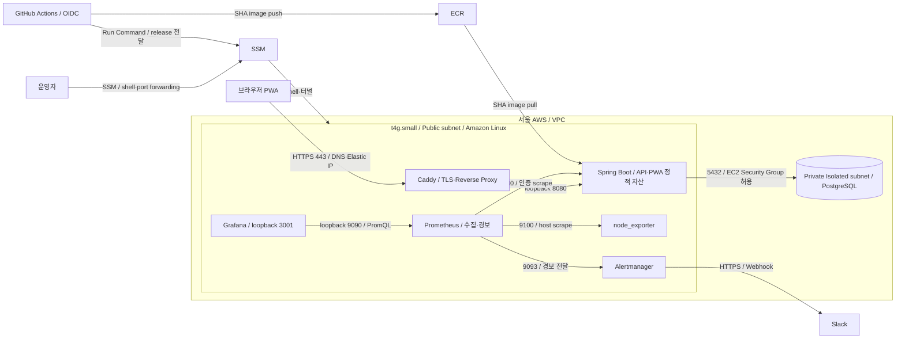

# Infrastructure

저장소의 CDK·배포 스크립트가 정의하는 구성이다. 실제 AWS의 배포 상태는 이 문서만으로 증명하지 않는다.
이 문서가 AWS·설정·배포·복구를 소유한다. 수집·알림·Grafana·자원 인수는 [Monitoring](../monitoring/README.md)을 따른다.

- [운영 배치](#운영-deployment) · [설정 준비](#설정과-비밀값)
- [앱 배포](#애플리케이션-배포) · [인프라 변경](#인프라-변경) · [DB 복구](#v11-schema와-복구)
- [EC2 접속](#ec2-접속) · [RDS 접속](#rds-접속) · [상태·장애 확인](#상태와-장애-확인)

## 운영 Deployment

운영 환경의 실제 배치 경계다. 전체 논리 구성은 [C4](../docs/architecture.md#c2-container)에 둔다.



프록시의 80·443만 인터넷에 공개한다. 업무·관측 포트는 loopback이고 RDS는 private다.
local Compose는 개발 구성이며 위 EC2 배치와 구분한다. 외부 인증·AI 연결은 C4에 표시한다.

## 리소스와 경계

| 대상 | 코드가 정의하는 값 |
| --- | --- |
| Region / VPC | ap-northeast-2, 10.20.0.0/16, 2 AZ |
| Subnet | Public application + Private Isolated database, NAT 없음 |
| EC2 | t4g.small ARM64 / Amazon Linux 2023, encrypted gp3 20 GiB, swap 2 GiB |
| RDS | PostgreSQL 17.9 / db.t4g.micro / Single-AZ, encrypted gp3 20 GiB, 최대 50 GiB, backup 7일 |
| 네트워크 | 인터넷 ingress 80·443만, app 127.0.0.1:8080, RDS 5432는 EC2 Security Group에서만 |
| ECR | my-fitness, immutable SHA tag, scan on push, 최근 10개 유지 |
| 애플리케이션 | my-fitness-app, restart unless-stopped; 자원 한도는 Monitoring의 운영 인수 참고 |
| DB pool | Hikari max 5 / min idle 1 |
| HTTPS | Caddy host network, Let's Encrypt, health 외 actuator 404 |
| 운영 수집 | 같은 EC2의 Prometheus·Grafana·Alertmanager·node_exporter; 한도·보관·인수는 Monitoring |

EC2 AMI는 서울의 기존 `ami-093fb7e528aec34e5`로 고정한다. 타입 증설에서 최신 AMI 조회로
인스턴스가 교체되지 않게 하며, AMI 교체는 별도 변경 집합·디스크 보존 검토를 거친다.
EC2 관리는 SSM을 사용한다. ALB·ECS·EKS·ASG는 구성하지 않는다.
CDK stack은 MyFitnessNetwork → MyFitnessDatabase → MyFitnessApplication → MyFitnessCicd 순서로 의존한다.
Route 53 record와 Caddy 실행은 stack 밖에서 관리한다. Amazon Linux bootstrap은 Docker·jq·AWS CLI·runtime 디렉터리와 swap을 준비하며 curl-minimal과 충돌하는 full curl을 추가하지 않는다.

## 설정과 비밀값

CDK가 만드는 Parameter Store는 `/my-fitness/prod/instance-id`, `ecr-repository-uri`, `db-host`, `db-secret-arn`이다.
다음 표는 사용자가 관리하는 `/my-fitness/prod/` 아래 parameter와 배포 시 환경 변수 연결이다.

| Parameter suffix | 타입 | 환경 변수 / 계약 |
| --- | --- | --- |
| google-client-id | String | GOOGLE_CLIENT_ID, 로그인 설정 |
| google-client-secret | SecureString | GOOGLE_CLIENT_SECRET |
| openai-api-key | SecureString | OPENAI_API_KEY, OpenAI 사용 시 필요 |
| app-base-url | String | FRONTEND_ORIGIN·LOGIN_SUCCESS_URL, 설정 시 SESSION_COOKIE_SECURE=true |
| ai-provider | String | AI_PROVIDER, 미설정 none, 사진 분석은 openai 필요 |
| typesafe-api-key | SecureString | TYPESAFE_API_KEY, 배포 preflight 필수 |
| ai-policy-model | String | AI_POLICY_MODEL, ParameterNotFound일 때 jev-1.13.0 |
| ai-policy-version | String | AI_POLICY_VERSION, ParameterNotFound일 때 fitness-policy-v1 |
| monitoring-password | SecureString | APP_MONITORING_PASSWORD·Prometheus password_file, 필수·동일 값 |
| grafana-admin-password | SecureString | Grafana 첫 DB 초기화의 admin 암호, 필수 |
| slack-webhook-url | SecureString | Alertmanager Incoming Webhook URL 파일, 필수 |

JEV 키 누락·빈 값과 정책 parameter의 SSM 접근 실패는 실행 중 컨테이너·환경 파일 교체 전에 배포를 중단한다.
모델·버전은 ParameterNotFound만 기본값으로 처리한다. 고객 관리 KMS 키를 쓰면 EC2 role의 decrypt 권한도 필요하다.
AI_POLICY_MODE·TYPESAFE_MODEL과 과거 ai-policy-mode parameter는 현재 코드에서 읽지 않는다.
과거 DB 로그의 mode 값 보존과 운영 경로 선택 제거는 별개다.

RDS username/password는 RDS가 생성한 Secrets Manager secret에서 읽는다.
배포 스크립트는 `/opt/my-fitness/runtime.env`를 권한 600으로 만들고 컨테이너에 전달한다.
운영 release는 app-base-url의 HTTPS 도메인이 필요하며 `prod,monitoring`을 활성화한다.
비밀값은 `/opt/my-fitness/monitoring/secrets`의 700 디렉터리·600 파일로 준비한다.
credential 초기화·UID·서비스 격리는 [Monitoring](../monitoring/README.md#설정-파일의-역할)을 따른다.
키·환경 파일·DB 비밀번호를 로그나 문서에 출력하지 않는다.

### 앱 환경 기본값

| 설정 | 기본값 / 범위 |
| --- | --- |
| DB_URL | jdbc:postgresql://localhost:5432/my_fitness, 로컬 개발 기본값 |
| GOOGLE_CLIENT_ID / SECRET | 미설정은 not-configured, 실제 로그인에는 유효한 값 필요 |
| LOGIN_SUCCESS_URL / FRONTEND_ORIGIN | http://localhost:3000 |
| AI_PROVIDER | none; openai·ollama는 서버 환경으로 선택 |
| AI_OPENAI_MODEL / AI_REQUEST_TIMEOUT | gpt-4o-mini / 30s, 재시도 0회 |
| OLLAMA_BASE_URL / AI_OLLAMA_MODEL | http://localhost:11434 / qwen3:1.7b |
| AI_POLICY_MODEL / AI_POLICY_VERSION | jev-1.13.0 / fitness-policy-v1 |
| AI_POLICY_TIMEOUT | 1500ms |
| multipart | file 5 MiB / request 6 MiB |

정책 임계값·판정 순서·사진 응답 계약은 [AI Reference](../docs/ai.md)에 둔다.
배포 스크립트는 AI_OPENAI_MODEL·AI_REQUEST_TIMEOUT·정책 timeout/임계값을 SSM에서 별도로 조회하지 않는다.
다른 값을 운영에 적용하려면 환경 파일 생성 계약도 함께 변경해야 한다.
로컬 `.env`는 Spring Boot가 자동으로 읽지 않는다.

## 애플리케이션 배포

1. 변경 코드와 검사를 확인한다. [Testing](../docs/testing.md)의 일반 검증을 통과한 commit을 대상으로 한다.
2. AWS GitHub OIDC role·ECR·SSM managed node와 필수 Parameter Store를 준비한다.
   GitHub repository variable AWS_DEPLOY_ROLE_ARN과 [설정 계약](#설정과-비밀값)을 확인한다.
3. main CI가 성공하면 Deploy App이 실행된다. 필요하면 GitHub Actions에서 Deploy App을 수동 실행한다.
   수동 workflow_dispatch는 선택 ref의 SHA를 사용하므로 검사한 commit인지 확인한다.
4. ECR SHA image → SSM Run Command → 내부 health → public health와 current-image를 확인한다.
   조회 명령은 [상태 확인](#상태와-장애-확인)을 따른다.

이미지는 GitHub runner에서 ARM64로 빌드하며 EC2에서 앱을 빌드하지 않는다.
기존 SHA tag는 재사용한다. health 실패 시 이전 이미지·runtime.env·RAM/swap 한도를 함께 복원한다.
설정 archive는 같은 SHA의 `/opt/my-fitness/monitoring/releases/<sha>`로 전달하고 checksum을 확인한다.
workflow는 `scripts/deploy-ssm.sh <sha>`를 실행한다. 이 스크립트가 `git archive`로 해당 SHA의
운영 파일만 묶고 크기를 확인한 뒤 SSM에 전달·결과를 확인한다. 작업 디렉터리의 미커밋 변경·비밀값·
local 설정·검증 소스는 포함하지 않는다. 조회 권한 오류를 실행 대기로 처리하지 않는다.
secret·자원·모니터링 설정·앱 parameter/image preflight 뒤 Caddy가 공개 지표를 차단한다.
모니터링 preflight는 서비스별 임시 암호 디렉터리를 읽기 전용으로 mount한다.
빈 credential volume에서도 검사할 수 있으며 실행 중인 credential volume은 갱신하지 않는다.
실제 secret-init은 적용 단계에서 실행하고 임시 암호는 preflight 종료 시 삭제한다.
이전 모니터링을 멈춘 뒤 앱을 교체하고, 앱 health 성공 후 모니터링을 시작한다.
모니터링 실패는 workflow 실패로 표시하되 정상 앱을 다시 교체하지 않는다.
모델/정책 version 문자열만 바꿔 코드의 판정 규칙을 되돌릴 수는 없다. legacy/shadow 시점의 이미지 복원은 정책 경로도 바꾼다.
로컬 stub 통과·원격 CI 통과·실공급자 검증·AWS 배포 확인을 각각 기록한다.

## 인프라 변경

저장소 루트에서 시작한다. Node 22와 AWS/CDK 인증이 필요하다.

```bash
cd infra
npm ci
npm run build
npm test -- --runInBand
npx cdk synth
npx cdk diff
```

위 검사 뒤 diff를 검토하고 필요한 StackName을 선택한다.

```bash
npx cdk deploy <StackName> --exclusively
```

리전은 `--region ap-northeast-2`로 명시한다. EC2 타입 변경 전 현재 AMI와 루트 volume을 확인하고,
변경 집합에서 인스턴스 교체가 없는지 확인한다. 타입 변경에는 일시 중단이 발생한다.
`<StackName>`은 실제 stack 이름으로 바꾸는 자리다. EC2 UserData·네트워크 변경은 replacement 여부를 확인한다.
Route 53 record와 Caddy는 별도 관리한다. EC2에 [setup-caddy.sh](../scripts/setup-caddy.sh)를 배치한 뒤 그 위치에서 실행한다.

```bash
sudo bash setup-caddy.sh dev-heon.com
```

## 음식 사진과 직접 식단 기록 배포

사진 분석은 기존 ai-provider=openai와 openai-api-key를 사용한다. 일반 대화의 typesafe-api-key도 유지한다.
별도 사진 키·S3·CDN·CDK stack은 없다. 파일·응답 제한은 [AI Reference](../docs/ai.md#음식-사진-분석)를 따른다.
AI_OPENAI_MODEL·AI_REQUEST_TIMEOUT에는 추가 SSM 조회가 없으므로 기본값 외 변경은 환경 파일 계약도 수정한다.

### V11 schema와 복구

V11__direct_meals_and_food_photos.sql은 사용 중인 식단 데이터가 없다는 승인 당시의 migration이다.
foods·이전 meal_foods를 제거하고 직접 입력 항목으로 교체한다. meals/nutrition_goals와 과거 AI 로그·V1~V10은 보존한다.
운영 데이터가 생긴 뒤 초기화를 위해 재사용하지 않는다. 배포된 migration을 덮어쓰거나 초기화 목적으로 다시 실행하지 않는다.

배포 전 복구 가능한 DB snapshot을 확보한다. 이전 카탈로그 API의 이미지는 새 schema와 호환되지 않으므로
previous image rollback만으로 V11을 되돌릴 수 없다. 새 schema를 지원하는 수정 이미지로 복구하거나 DB snapshot과 호환 이미지 복원을 함께 수행한다.
로컬 PostgreSQL/HTTP 대역 통과가 운영 RDS 적용·실제 음식 인식·모바일 PWA 확인을 대신하지 않는다.

## 모니터링 적용 범위

[Monitoring](../monitoring/README.md#운영-단일-ec2)의 신규 SecureString 3개와 app-base-url을 먼저 준비한다.
CI의 격리된 Compose 검사는 GitHub runner에서만 실행하며, Deploy App의 SSM 단계가 운영 스택을 설치한다.
main 자동 배포와 수동 workflow_dispatch는 모두 이 release 경로를 사용한다.
CI는 `scripts/verify-monitoring.sh`로 local/prod를 함께 검사하며 테스트용 프로젝트만 정리한다.
기존 EC2도 SSM에서 setup-ec2-monitoring.sh가 실행되므로 UserData 업데이트만 기다리지 않는다.
small 구성의 실제 자원 인수와 Slack 확인은 [모니터링 인수 기준](../monitoring/README.md#운영-인수)을 따른다.

앱은 성공했지만 모니터링만 실패하면 Actions/SSM 상태와 health를 각각 확인한다.
이전 release의 Compose 파일이 실제로 존재할 때만 volume을 보존한 복원을 시도한다. 복원 로그만으로 정상 수집이라 판단하지 않는다.
메모리가 부족하면 현재 release의 모니터링을 먼저 stop하고 앱을 유지한다. prod에서 `down -v`하지 않는다.
축소된 TSDB retention으로 이미 삭제된 데이터는 설정 복원으로 되살아나지 않는다.

## EC2 접속

AWS CLI 인증·Session Manager plugin이 필요하다. macOS에서 plugin이 없으면 `brew install --cask session-manager-plugin`을 사용한다.
아래는 로컬 터미널에서 실행한다. SSH 22를 열지 않는다.

```bash
INSTANCE_ID=$(aws ssm get-parameter \
  --name /my-fitness/prod/instance-id --region ap-northeast-2 \
  --query 'Parameter.Value' --output text)
aws ssm start-session --region ap-northeast-2 --target "$INSTANCE_ID"
```

Session Manager shell·port forwarding은 Active Session에 보인다. GitHub 배포의 Run Command는 별도 history에서 확인한다.
Active Session이 없다는 이유로 배포 실패라고 판단하지 않는다. Grafana 접속은 [Monitoring](../monitoring/README.md#운영-단일-ec2)을 따른다.

## RDS 접속

앞 단계에서 조회한 INSTANCE_ID를 같은 로컬 터미널에서 사용한다. RDS를 public으로 바꾸지 않는다.

```bash
DB_HOST=$(aws ssm get-parameter \
  --name /my-fitness/prod/db-host --region ap-northeast-2 \
  --query 'Parameter.Value' --output text)
aws ssm start-session --target "$INSTANCE_ID" --region ap-northeast-2 \
  --document-name AWS-StartPortForwardingSessionToRemoteHost \
  --parameters "host=$DB_HOST,portNumber=5432,localPortNumber=15432"
```

IntelliJ는 localhost:15432 / database my_fitness와 RDS secret의 username/password를 사용한다.
운영 조회는 가능하면 read-only로 설정한다. DB secret·runtime.env를 출력하거나 문서에 복사하지 않는다.

## 상태와 장애 확인

로컬 터미널에서 공개 health를, SSM shell에서 컨테이너·내부 health·배포 SHA를 확인한다.

```bash
curl --fail --silent https://dev-heon.com/actuator/health
```

```bash
sudo docker ps
curl --fail --silent http://127.0.0.1:8080/actuator/health
cat /opt/my-fitness/current-image
sudo docker logs --tail 200 my-fitness-app
sudo docker logs --tail 200 my-fitness-caddy
```

기본 앱·프록시는 my-fitness-app / my-fitness-caddy다. 앱 로그는 Docker stdout/stderr이며 local driver 10m×3로 제한한다.
CloudWatch 기본 EC2/RDS 지표와 RDS PostgreSQL log export를 확인할 수 있다.
CloudWatch Agent IAM 권한만으로 Docker 앱 로그 수집이 활성화되지는 않는다. 현재 앱 중앙 로그 수집 설정은 없다.

| 증상 | 확인 순서 |
| --- | --- |
| 사이트 접속 실패 | Route 53 A record → EC2 Running/status check → Caddy → 앱 → 내부/public health |
| API 500 | 발생 시각·앱 예외 → RDS 상태 → DB 연결·transaction → 최근 배포 SHA |
| DB 연결 실패 | RDS Available → SG의 EC2 허용 → 5432 경로 → RDS secret·db-host → 앱 로그 |
| 배포 실패 | CI → Deploy App → ECR SHA → SSM Run Command → 컨테이너 로그 → current-image |
| 앱 정상·모니터링 실패 | 앱 health 유지 → Actions/SSM 실패 → Monitoring의 중단·복구·자원 검사 |
| AI 요청 실패 | [AI 오류 계약](../docs/ai.md#실패와-답변-생성) → 지표 오류 유형 → 기존 요청 이력의 진단 위치 |

원문 질문·사진·모델 응답·키를 출력하지 않는다. 원인을 모른 채 정책 검증이나 임계값을 완화하지 않는다.
사진의 NOT_FOOD/UNCERTAIN은 정상 판별이며 JEV 평가 실패와 구분한다.
운영 release는 `prod,monitoring`과 전용 암호를 함께 사용한다. 프로필·지표 접근은 [Monitoring](../monitoring/README.md#실행)이 소유한다.

AWS Console에서는 EC2 status·CPU credit, RDS FreeableMemory·FreeStorageSpace·connections,
ECR image/lifecycle, SSM history, CloudFormation stack, Route 53와 secret/parameter 상태·비용을 확인한다.
배포 뒤 최신 SHA와 current-image를 대조하고 rollback 여부를 확인한다.
장애 조사 편의를 위해 RDS public/5432·앱 8080·SSH 22를 인터넷에 열거나 장기 AWS 키를 만들지 않는다.
확인 없이 `cdk deploy --all`을 실행하지 않는다.

## 근거와 과거 기록

- [CDK](.) · [앱 설정](../src/main/resources/application.yml) · [CI](../.github/workflows/ci.yml) · [Deploy App](../.github/workflows/deploy-app.yml)
- [배포 SSM 전달](../scripts/deploy-ssm.sh) · [앱 적용](../scripts/deploy-ec2.sh) · [모니터링 적용](../scripts/deploy-monitoring.sh)
- [AWS 초기 스펙](../docs/archive/specs/2026-09-23-aws-cdk-ecr-cicd-spec.md): 당시 계획·비용·운영 결과이며 현재 기준이 아니다.
- [단일 EC2 결정](../docs/adr/0004-single-ec2-monitoring.md): 배치 선택과 운영 관측의 한계.
